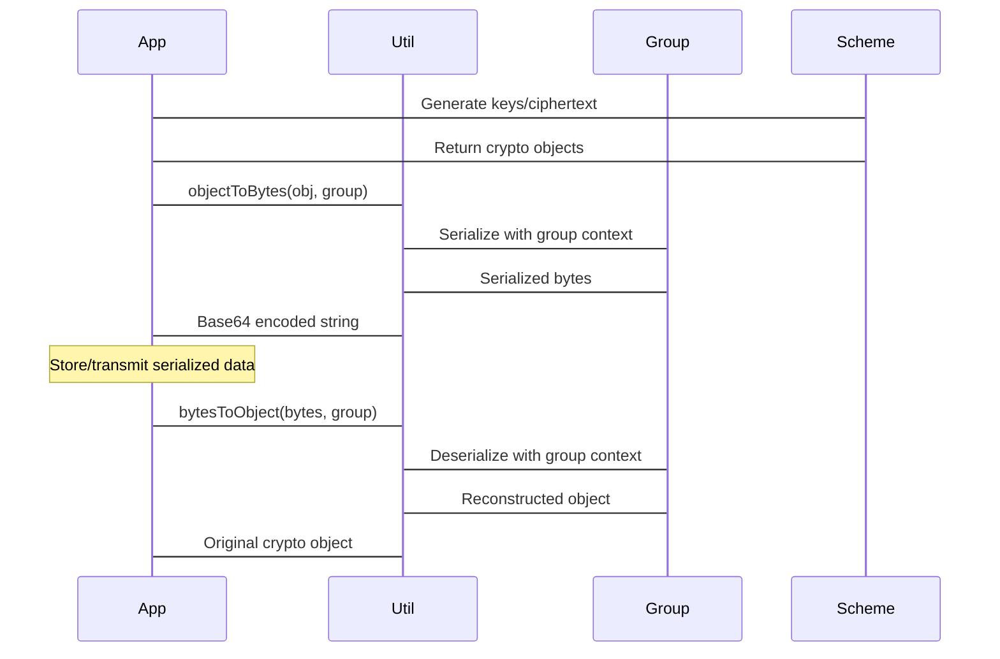

# Application Development

> **Relevant source files**
> * [charm/core/math/pairing/miracl/miracl_interface.cc](https://github.com/JHUISI/charm/blob/7b52fa53/charm/core/math/pairing/miracl/miracl_interface.cc)
> * [charm/core/math/pairing/miracl/miracl_interface.h](https://github.com/JHUISI/charm/blob/7b52fa53/charm/core/math/pairing/miracl/miracl_interface.h)
> * [doc/source/cryptographers.rst](https://github.com/JHUISI/charm/blob/7b52fa53/doc/source/cryptographers.rst)
> * [doc/source/developers.rst](https://github.com/JHUISI/charm/blob/7b52fa53/doc/source/developers.rst)
> * [doc/source/miracl.rst](https://github.com/JHUISI/charm/blob/7b52fa53/doc/source/miracl.rst)
> * [doc/source/mobile.rst](https://github.com/JHUISI/charm/blob/7b52fa53/doc/source/mobile.rst)
> * [doc/source/relic.rst](https://github.com/JHUISI/charm/blob/7b52fa53/doc/source/relic.rst)
> * [doc/source/updates.rst](https://github.com/JHUISI/charm/blob/7b52fa53/doc/source/updates.rst)
> * [embed/Makefile](https://github.com/JHUISI/charm/blob/7b52fa53/embed/Makefile)
> * [embed/README.md](https://github.com/JHUISI/charm/blob/7b52fa53/embed/README.md)
> * [embed/charm_embed_api.c](https://github.com/JHUISI/charm/blob/7b52fa53/embed/charm_embed_api.c)
> * [embed/charm_embed_api.h](https://github.com/JHUISI/charm/blob/7b52fa53/embed/charm_embed_api.h)
> * [embed/test.c](https://github.com/JHUISI/charm/blob/7b52fa53/embed/test.c)

This document covers how to integrate Charm-Crypto into your applications, whether you're developing in Python or C/C++. It provides practical guidance for application developers who want to use Charm's cryptographic schemes and utilities in their software projects.

For implementing new cryptographic schemes, see the cryptographers guide in the Python API section [7.1](/JHUISI/charm/7.1-python-api-and-development-guide). For details on the core mathematical foundations, see [3](/JHUISI/charm/3-core-mathematical-foundation).

## Application Integration Overview

Charm-Crypto supports application development through two primary interfaces: a Python API for direct integration with Python applications, and a C/C++ embedding API for native applications. Both approaches provide access to the same underlying cryptographic functionality.

### Python vs C/C++ Integration Comparison

| Feature | Python API | C/C++ Embedding API |
| --- | --- | --- |
| **Primary Files** | Scheme modules in `charm/schemes/` | `embed/charm_embed_api.h` |
| **Initialization** | Direct imports: `from charm.schemes.pkenc.pkenc_cs98 import CS98` | `InitializeCharm()`, `InitPairingGroup()` |
| **Scheme Usage** | Native Python objects and methods | `InitScheme()`, `CallMethod()` with format strings |
| **Serialization** | `objectToBytes()`, `bytesToObject()` | `objectToBytes()`, `bytesToObject()` functions |
| **Memory Management** | Automatic Python GC | Manual with `Free()` macro |
| **Error Handling** | Python exceptions | Return code checking |

Sources: [doc/source/developers.rst L1-L130](https://github.com/JHUISI/charm/blob/7b52fa53/doc/source/developers.rst#L1-L130)

 [embed/charm_embed_api.h L30-L161](https://github.com/JHUISI/charm/blob/7b52fa53/embed/charm_embed_api.h#L30-L161)

## Python Application Development

### Basic Scheme Usage Pattern

The standard pattern for using cryptographic schemes in Python applications follows an object-oriented approach:

```

```

Sources: [doc/source/developers.rst L10-L28](https://github.com/JHUISI/charm/blob/7b52fa53/doc/source/developers.rst#L10-L28)

### Scheme Instantiation and Lifecycle

The typical application workflow involves these key classes and methods:

```

```

Sources: [doc/source/developers.rst L14-L27](https://github.com/JHUISI/charm/blob/7b52fa53/doc/source/developers.rst#L14-L27)

 [doc/source/cryptographers.rst L41-L91](https://github.com/JHUISI/charm/blob/7b52fa53/doc/source/cryptographers.rst#L41-L91)

### Serialization Integration

Applications can serialize keys and ciphertexts using the `objectToBytes` and `bytesToObject` functions from `charm.core.engine.util`:



Sources: [doc/source/developers.rst L30-L73](https://github.com/JHUISI/charm/blob/7b52fa53/doc/source/developers.rst#L30-L73)

## C/C++ Embedding API

### API Architecture and Core Functions

The C/C++ embedding API provides a Python interpreter wrapper that allows native applications to use Charm functionality:

```

```

Sources: [embed/charm_embed_api.h L110-L130](https://github.com/JHUISI/charm/blob/7b52fa53/embed/charm_embed_api.h#L110-L130)

 [embed/charm_embed_api.c L71-L93](https://github.com/JHUISI/charm/blob/7b52fa53/embed/charm_embed_api.c#L71-L93)

### C API Function Reference

The embedding API provides these essential functions for application integration:

| Function | Purpose | Parameters | Return Type |
| --- | --- | --- | --- |
| `InitializeCharm()` | Initialize Python interpreter | void | int (status) |
| `InitPairingGroup()` | Create pairing group | module, param_id | `Charm_t*` |
| `InitScheme()` | Load cryptographic scheme | class_file, class_name, group | `Charm_t*` |
| `InitAdapter()` | Load scheme adapter | class_file, class_name, scheme, group | `Charm_t*` |
| `CallMethod()` | Call scheme methods | object, func_name, format, ... | `Charm_t*` |
| `GetDict()` | Extract dictionary values | object, key | `Charm_t*` |
| `objectToBytes()` | Serialize objects | object, group | `Charm_t*` |
| `CleanupCharm()` | Cleanup interpreter | void | void |

Sources: [embed/charm_embed_api.h L110-L130](https://github.com/JHUISI/charm/blob/7b52fa53/embed/charm_embed_api.h#L110-L130)

### C/C++ Usage Example Pattern

The typical C application follows this initialization and usage pattern:

```

```

Sources: [embed/test.c L130-L148](https://github.com/JHUISI/charm/blob/7b52fa53/embed/test.c#L130-L148)

 [embed/charm_embed_api.c L356-L436](https://github.com/JHUISI/charm/blob/7b52fa53/embed/charm_embed_api.c#L356-L436)

### Format String System

The `CallMethod` function uses a format string system to pass arguments:

| Format Code | Type | Example Usage |
| --- | --- | --- |
| `%s` | String | `"policy string"` |
| `%b` | Bytes | Binary data |
| `%I` | Integer constant | GT, G1, G2 group identifiers |
| `%i` | Integer pointer | `&int_var` |
| `%A` | Attribute list | `"[ONE, TWO, THREE]"` |
| `%O` | Charm object | Previously created objects |

Sources: [embed/charm_embed_api.c L369-L415](https://github.com/JHUISI/charm/blob/7b52fa53/embed/charm_embed_api.c#L369-L415)

### Hybrid Encryption Adapter Example

The API supports adapter patterns for combining schemes:

```

```

Sources: [embed/test.c L60-L128](https://github.com/JHUISI/charm/blob/7b52fa53/embed/test.c#L60-L128)

## Integration Patterns and Best Practices

### Memory Management in C/C++ Integration

The C embedding API requires careful memory management:

```

```

Sources: [embed/charm_embed_api.c L438-L460](https://github.com/JHUISI/charm/blob/7b52fa53/embed/charm_embed_api.c#L438-L460)

 [embed/test.c L47-L57](https://github.com/JHUISI/charm/blob/7b52fa53/embed/test.c#L47-L57)

### Error Handling Patterns

Both APIs provide different error handling mechanisms:

| API | Error Detection | Error Information |
| --- | --- | --- |
| **Python** | Exception handling | Full Python tracebacks |
| **C/C++** | NULL return values | `PyErr_Occurred()`, `PyErr_Print()` |

Sources: [embed/charm_embed_api.c L95-L101](https://github.com/JHUISI/charm/blob/7b52fa53/embed/charm_embed_api.c#L95-L101)

### Application Development Workflow

```

```

Sources: [doc/source/developers.rst L1-L130](https://github.com/JHUISI/charm/blob/7b52fa53/doc/source/developers.rst#L1-L130)

 [embed/README.md L1-L23](https://github.com/JHUISI/charm/blob/7b52fa53/embed/README.md#L1-L23)