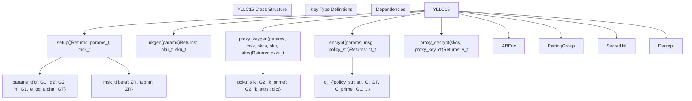
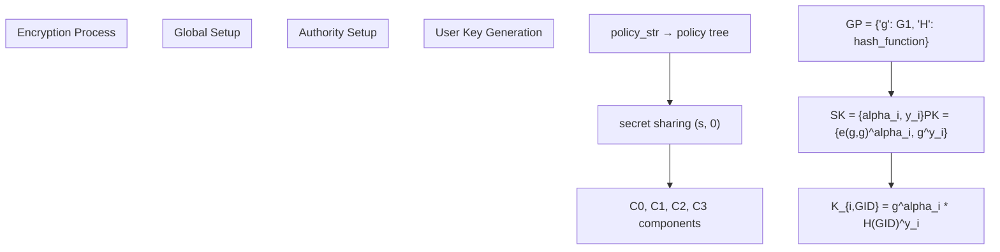
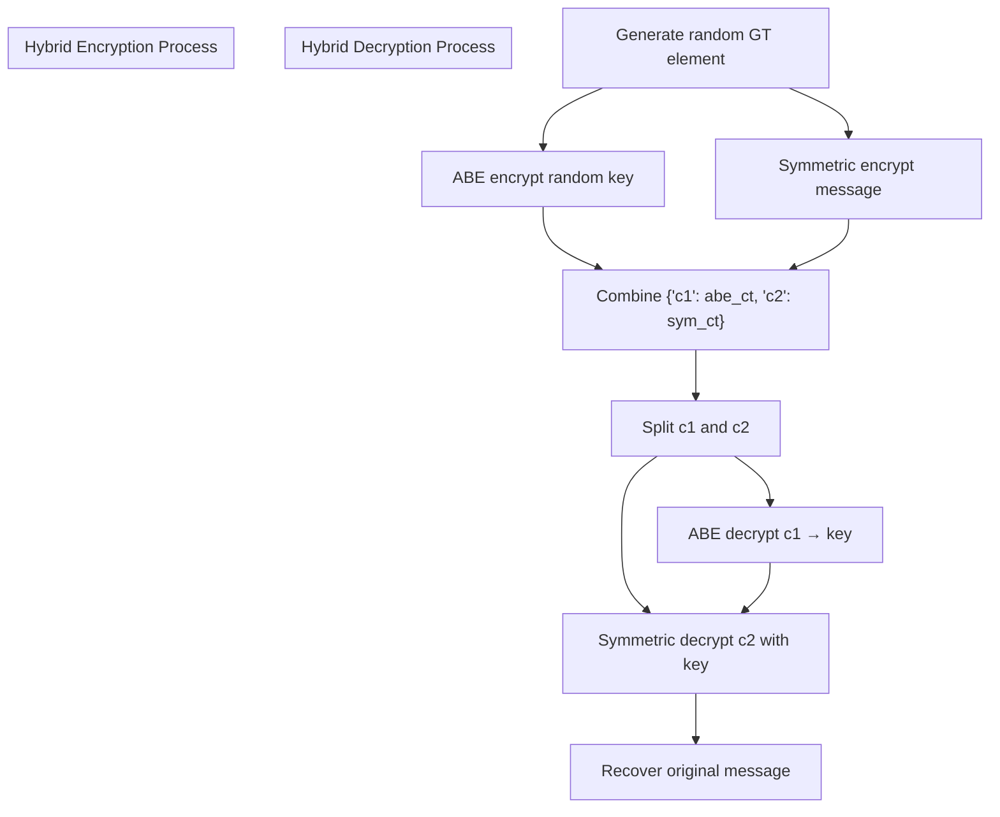
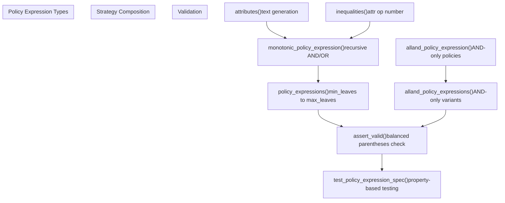

# Attribute-Based Encryption

> **Relevant source files**
> * [.gitignore](https://github.com/JHUISI/charm/blob/7b52fa53/.gitignore)
> * [.travis.yml](https://github.com/JHUISI/charm/blob/7b52fa53/.travis.yml)
> * [VERSION](https://github.com/JHUISI/charm/blob/7b52fa53/VERSION)
> * [charm/adapters/__init__.py](https://github.com/JHUISI/charm/blob/7b52fa53/charm/adapters/__init__.py)
> * [charm/adapters/abenc_adapt_hybrid.py](https://github.com/JHUISI/charm/blob/7b52fa53/charm/adapters/abenc_adapt_hybrid.py)
> * [charm/adapters/dabenc_adapt_hybrid.py](https://github.com/JHUISI/charm/blob/7b52fa53/charm/adapters/dabenc_adapt_hybrid.py)
> * [charm/adapters/ibenc_adapt_hybrid.py](https://github.com/JHUISI/charm/blob/7b52fa53/charm/adapters/ibenc_adapt_hybrid.py)
> * [charm/adapters/kpabenc_adapt_hybrid.py](https://github.com/JHUISI/charm/blob/7b52fa53/charm/adapters/kpabenc_adapt_hybrid.py)
> * [charm/schemes/abenc/abenc_maabe_rw15.py](https://github.com/JHUISI/charm/blob/7b52fa53/charm/schemes/abenc/abenc_maabe_rw15.py)
> * [charm/schemes/abenc/abenc_yllc15.py](https://github.com/JHUISI/charm/blob/7b52fa53/charm/schemes/abenc/abenc_yllc15.py)
> * [charm/schemes/abenc/dabe_aw11.py](https://github.com/JHUISI/charm/blob/7b52fa53/charm/schemes/abenc/dabe_aw11.py)
> * [charm/test/schemes/abenc/abenc_yllc15_test.py](https://github.com/JHUISI/charm/blob/7b52fa53/charm/test/schemes/abenc/abenc_yllc15_test.py)
> * [charm/test/toolbox/test_policy_expression.py](https://github.com/JHUISI/charm/blob/7b52fa53/charm/test/toolbox/test_policy_expression.py)
> * [charm/toolbox/policy_expression_spec.py](https://github.com/JHUISI/charm/blob/7b52fa53/charm/toolbox/policy_expression_spec.py)
> * [requirements.txt](https://github.com/JHUISI/charm/blob/7b52fa53/requirements.txt)

## Purpose and Scope

This document covers the Attribute-Based Encryption (ABE) implementations within Charm-Crypto, including ciphertext-policy ABE, key-policy ABE, multi-authority ABE, and decentralized ABE schemes. The ABE subsystem provides cryptographic schemes that enable fine-grained access control based on attributes assigned to users and policies embedded in ciphertexts or keys.

For symmetric cryptography and traditional PKI schemes, see [Symmetric Cryptography and PKI Schemes](/JHUISI/charm/6.2-symmetric-cryptography-and-pki-schemes). For mathematical foundations underlying ABE operations, see [Core Mathematical Foundation](/JHUISI/charm/3-core-mathematical-foundation).

## ABE System Architecture

The ABE subsystem in Charm-Crypto consists of multiple layers: core scheme implementations, hybrid encryption adapters, and comprehensive testing infrastructure. The following diagram illustrates the overall architecture:

```mermaid
flowchart TD

subgraph Testing_Infrastructure ["Testing Infrastructure"]
end

subgraph Mathematical_Foundation ["Mathematical Foundation"]
end

subgraph Hybrid_Encryption_Adapters ["Hybrid Encryption Adapters"]
end

subgraph Base_Classes_and_Interfaces ["Base Classes and Interfaces"]
end

subgraph ABE_Scheme_Implementations ["ABE Scheme Implementations"]
end

YLLC15["YLLC15abenc_yllc15.py"]
MaabeRW15["MaabeRW15abenc_maabe_rw15.py"]
DabeAW11["Dabedabe_aw11.py"]
ABEnc["ABEnctoolbox.ABEnc"]
ABEncMultiAuth["ABEncMultiAuthtoolbox.ABEncMultiAuth"]
HybridABEnc["HybridABEncabenc_adapt_hybrid.py"]
HybridABEncMA["HybridABEncMAdabenc_adapt_hybrid.py"]
HybridKPABEnc["HybridABEnckpabenc_adapt_hybrid.py"]
PairingGroup["PairingGrouptoolbox.pairinggroup"]
SecretUtil["SecretUtiltoolbox.secretutil"]
PolicyExpr["Policy Expressionspolicy_expression_spec.py"]
YLLCTest["YLLC15Testabenc_yllc15_test.py"]
PolicyTest["TestPolicyExpressionSpectest_policy_expression.py"]
HypothesisGen["Hypothesis Generatorspolicy_expression_spec.py"]

    YLLC15 --> ABEnc
    MaabeRW15 --> ABEncMultiAuth
    DabeAW11 --> ABEncMultiAuth
    HybridABEnc --> YLLC15
    HybridABEncMA --> DabeAW11
    HybridKPABEnc --> ABEnc
    YLLC15 --> PairingGroup
    YLLC15 --> SecretUtil
    MaabeRW15 --> PairingGroup
    MaabeRW15 --> SecretUtil
    DabeAW11 --> PairingGroup
    DabeAW11 --> SecretUtil
    YLLCTest --> YLLC15
    YLLCTest --> PolicyExpr
    PolicyTest --> PolicyExpr
    HypothesisGen --> PolicyExpr
```



**Sources:** [charm/schemes/abenc/abenc_yllc15.py](https://github.com/JHUISI/charm/blob/7b52fa53/charm/schemes/abenc/abenc_yllc15.py)

 [charm/schemes/abenc/abenc_maabe_rw15.py](https://github.com/JHUISI/charm/blob/7b52fa53/charm/schemes/abenc/abenc_maabe_rw15.py)

 [charm/schemes/abenc/dabe_aw11.py](https://github.com/JHUISI/charm/blob/7b52fa53/charm/schemes/abenc/dabe_aw11.py)

 [charm/adapters/abenc_adapt_hybrid.py](https://github.com/JHUISI/charm/blob/7b52fa53/charm/adapters/abenc_adapt_hybrid.py)

 [charm/adapters/dabenc_adapt_hybrid.py](https://github.com/JHUISI/charm/blob/7b52fa53/charm/adapters/dabenc_adapt_hybrid.py)

 [charm/toolbox/policy_expression_spec.py](https://github.com/JHUISI/charm/blob/7b52fa53/charm/toolbox/policy_expression_spec.py)

## Core ABE Scheme Implementations

### YLLC15 - Extended Proxy-Assisted ABE

The `YLLC15` class implements the "Extended Proxy-Assisted Approach: Achieving Revocable Fine-Grained Encryption of Cloud Data" scheme, adapted from BSW07. This scheme supports proxy-based decryption with fine-grained attribute-based access control.



The YLLC15 scheme operates through a two-stage decryption process:

1. **Proxy Decryption**: The cloud server performs partial decryption using `proxy_decrypt()` [charm/schemes/abenc/abenc_yllc15.py L128-L157](https://github.com/JHUISI/charm/blob/7b52fa53/charm/schemes/abenc/abenc_yllc15.py#L128-L157)
2. **Final Decryption**: The user completes decryption using `decrypt()` [charm/schemes/abenc/abenc_yllc15.py L161-L172](https://github.com/JHUISI/charm/blob/7b52fa53/charm/schemes/abenc/abenc_yllc15.py#L161-L172)

**Sources:** [charm/schemes/abenc/abenc_yllc15.py L38-L173](https://github.com/JHUISI/charm/blob/7b52fa53/charm/schemes/abenc/abenc_yllc15.py#L38-L173)

### Multi-Authority ABE (MaabeRW15)

The `MaabeRW15` class implements the Rouselakis-Waters multi-authority ABE scheme, enabling multiple independent attribute authorities to issue keys for different attribute domains.

| Method | Purpose | Key Features |
| --- | --- | --- |
| `setup()` | Global parameter generation | Returns bilinear group parameters |
| `authsetup(gp, name)` | Authority setup | Each authority generates independent keys |
| `keygen(gp, sk, gid, attribute)` | Single attribute key generation | Keys bound to global user ID |
| `multiple_attributes_keygen()` | Batch key generation | Efficient multi-attribute key creation |
| `encrypt(gp, pks, message, policy_str)` | Policy-based encryption | Supports complex access policies |
| `decrypt(gp, sk, ct)` | Decryption with user keys | Requires sufficient attributes |

The scheme uses the attribute format `ATTRIBUTE@AUTHORITY` to distinguish between attributes from different authorities [charm/schemes/abenc/abenc_maabe_rw15.py L104-L106](https://github.com/JHUISI/charm/blob/7b52fa53/charm/schemes/abenc/abenc_maabe_rw15.py#L104-L106)

**Sources:** [charm/schemes/abenc/abenc_maabe_rw15.py L37-L224](https://github.com/JHUISI/charm/blob/7b52fa53/charm/schemes/abenc/abenc_maabe_rw15.py#L37-L224)

### Decentralized ABE (Dabe)

The `Dabe` class implements the Lewko-Waters decentralized ABE scheme, providing a fully decentralized approach where authorities operate independently without a trusted central authority.



**Sources:** [charm/schemes/abenc/dabe_aw11.py L20-L197](https://github.com/JHUISI/charm/blob/7b52fa53/charm/schemes/abenc/dabe_aw11.py#L20-L197)

## Hybrid Encryption Adapters

### HybridABEnc Pattern

The hybrid encryption adapters implement a common pattern that combines ABE schemes with symmetric encryption for efficient handling of large messages:



The hybrid pattern is implemented in:

* `HybridABEnc` for single-authority schemes [charm/adapters/abenc_adapt_hybrid.py L10-L49](https://github.com/JHUISI/charm/blob/7b52fa53/charm/adapters/abenc_adapt_hybrid.py#L10-L49)
* `HybridABEncMA` for multi-authority schemes [charm/adapters/dabenc_adapt_hybrid.py L8-L78](https://github.com/JHUISI/charm/blob/7b52fa53/charm/adapters/dabenc_adapt_hybrid.py#L8-L78)
* Key-policy ABE hybrid variant [charm/adapters/kpabenc_adapt_hybrid.py L8-L49](https://github.com/JHUISI/charm/blob/7b52fa53/charm/adapters/kpabenc_adapt_hybrid.py#L8-L49)

**Sources:** [charm/adapters/abenc_adapt_hybrid.py](https://github.com/JHUISI/charm/blob/7b52fa53/charm/adapters/abenc_adapt_hybrid.py)

 [charm/adapters/dabenc_adapt_hybrid.py](https://github.com/JHUISI/charm/blob/7b52fa53/charm/adapters/dabenc_adapt_hybrid.py)

 [charm/adapters/kpabenc_adapt_hybrid.py](https://github.com/JHUISI/charm/blob/7b52fa53/charm/adapters/kpabenc_adapt_hybrid.py)

## Policy Expression System

### Policy Expression Generation

The testing infrastructure includes sophisticated policy expression generation using the Hypothesis property-based testing framework:



**Sources:** [charm/toolbox/policy_expression_spec.py L1-L71](https://github.com/JHUISI/charm/blob/7b52fa53/charm/toolbox/policy_expression_spec.py#L1-L71)

 [charm/test/toolbox/test_policy_expression.py L1-L17](https://github.com/JHUISI/charm/blob/7b52fa53/charm/test/toolbox/test_policy_expression.py#L1-L17)

### Property-Based Testing Integration

The ABE schemes use Hypothesis for comprehensive testing with automatically generated test cases:

| Test Function | Purpose | Strategy Used |
| --- | --- | --- |
| `test_proxy_key_gen_deduplicates_and_uppercases_attributes` | Attribute normalization | `lists(attributes())` |
| `test_encrypt_proxy_decrypt_decrypt_round_trip` | End-to-end functionality | `policy_expressions()` |
| `test_policy_not_satisfied` | Access control enforcement | `policy_expressions()` |

The tests use custom Hypothesis strategies defined in `policy_expression_spec.py` to generate valid policy expressions [charm/test/schemes/abenc/abenc_yllc15_test.py L29-L70](https://github.com/JHUISI/charm/blob/7b52fa53/charm/test/schemes/abenc/abenc_yllc15_test.py#L29-L70)

**Sources:** [charm/test/schemes/abenc/abenc_yllc15_test.py](https://github.com/JHUISI/charm/blob/7b52fa53/charm/test/schemes/abenc/abenc_yllc15_test.py)

 [charm/toolbox/policy_expression_spec.py](https://github.com/JHUISI/charm/blob/7b52fa53/charm/toolbox/policy_expression_spec.py)

## Implementation Patterns

### Type Annotations and Input/Output Decorators

ABE schemes use structured type definitions for clear interface specification:

```
# Type definitions from YLLC15
params_t = {'g': G1, 'g2': G2, 'h': G1, 'e_gg_alpha': GT}
msk_t = {'beta': ZR, 'alpha': ZR}
ct_t = {'policy_str': str, 'C': GT, 'C_prime': G1, 'C_prime_prime': G1, 'c_attrs': dict}
```

Methods use `@Input` and `@Output` decorators for type checking [charm/schemes/abenc/abenc_yllc15.py L23-L36](https://github.com/JHUISI/charm/blob/7b52fa53/charm/schemes/abenc/abenc_yllc15.py#L23-L36)

### Attribute Normalization

ABE implementations consistently normalize attributes to uppercase to ensure policy matching works correctly [charm/schemes/abenc/abenc_yllc15.py L85-L86](https://github.com/JHUISI/charm/blob/7b52fa53/charm/schemes/abenc/abenc_yllc15.py#L85-L86)

### Secret Sharing Integration

All ABE schemes integrate with `SecretUtil` for policy tree parsing and secret sharing:

* Policy creation: `self.util.createPolicy(policy_str)`
* Share calculation: `self.util.calculateSharesDict(s, policy)`
* Coefficient computation: `self.util.getCoefficients(policy)`

**Sources:** [charm/schemes/abenc/abenc_yllc15.py L44-L45](https://github.com/JHUISI/charm/blob/7b52fa53/charm/schemes/abenc/abenc_yllc15.py#L44-L45)

 [charm/schemes/abenc/abenc_maabe_rw15.py

77](https://github.com/JHUISI/charm/blob/7b52fa53/charm/schemes/abenc/abenc_maabe_rw15.py#L77-L77)

 [charm/schemes/abenc/dabe_aw11.py

44](https://github.com/JHUISI/charm/blob/7b52fa53/charm/schemes/abenc/dabe_aw11.py#L44-L44)