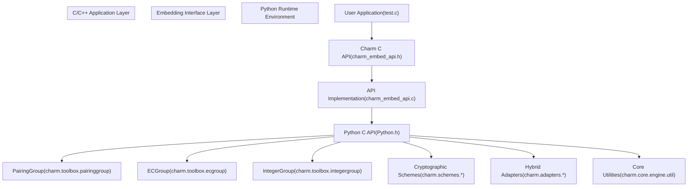
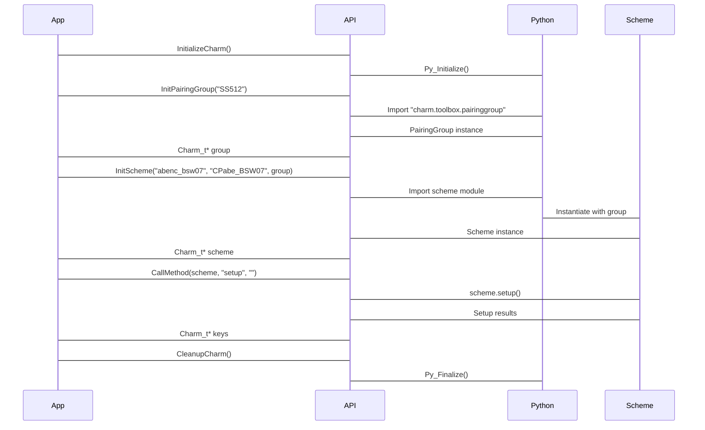
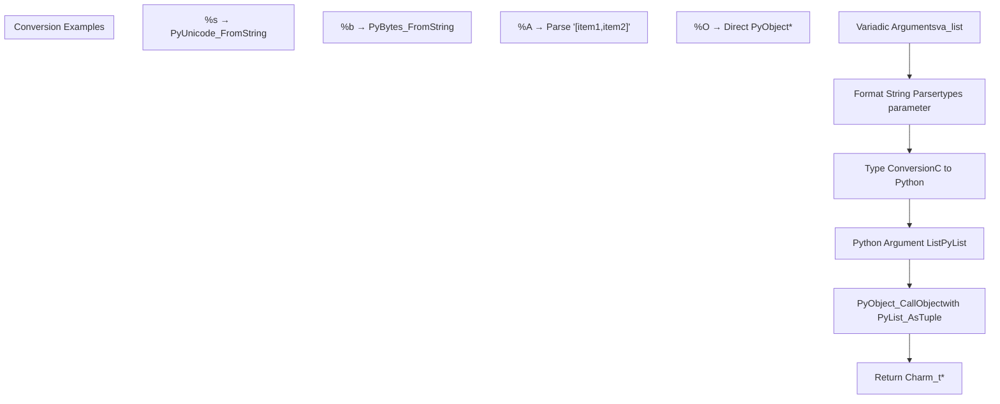
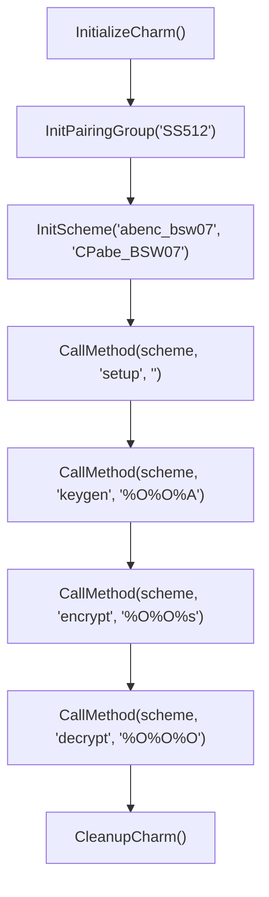
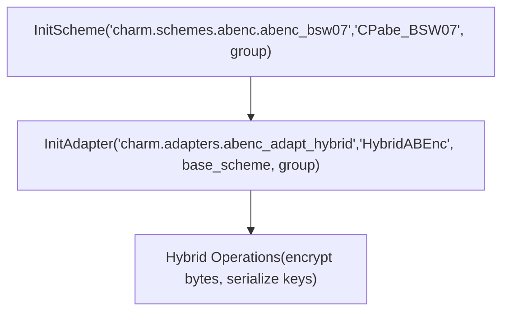

# C/C++ Embedding API

> **Relevant source files**
> * [charm/core/math/pairing/miracl/miracl_interface.cc](https://github.com/JHUISI/charm/blob/7b52fa53/charm/core/math/pairing/miracl/miracl_interface.cc)
> * [charm/core/math/pairing/miracl/miracl_interface.h](https://github.com/JHUISI/charm/blob/7b52fa53/charm/core/math/pairing/miracl/miracl_interface.h)
> * [embed/Makefile](https://github.com/JHUISI/charm/blob/7b52fa53/embed/Makefile)
> * [embed/README.md](https://github.com/JHUISI/charm/blob/7b52fa53/embed/README.md)
> * [embed/charm_embed_api.c](https://github.com/JHUISI/charm/blob/7b52fa53/embed/charm_embed_api.c)
> * [embed/charm_embed_api.h](https://github.com/JHUISI/charm/blob/7b52fa53/embed/charm_embed_api.h)
> * [embed/test.c](https://github.com/JHUISI/charm/blob/7b52fa53/embed/test.c)

## Purpose and Scope

The C/C++ Embedding API provides a native interface for integrating Charm-Crypto's Python-based cryptographic schemes and mathematical operations into C and C++ applications. This API wraps Charm's Python functionality using the Python C API, allowing developers to access the full range of pairing-based cryptography, elliptic curve operations, and cryptographic schemes without requiring Python knowledge or Python runtime dependencies in their applications.

For information about the underlying Python framework that this API wraps, see [Python Cryptographic Framework](/JHUISI/charm/5-python-cryptographic-framework). For details about cryptographic schemes available through this interface, see [Cryptographic Schemes](/JHUISI/charm/6-cryptographic-schemes).

## Architecture Overview

The embedding API creates a bridge between C/C++ applications and Charm's Python cryptographic framework through a carefully designed abstraction layer.

### System Architecture



Sources: [embed/charm_embed_api.h L1-L162](https://github.com/JHUISI/charm/blob/7b52fa53/embed/charm_embed_api.h#L1-L162)

 [embed/charm_embed_api.c L1-L552](https://github.com/JHUISI/charm/blob/7b52fa53/embed/charm_embed_api.c#L1-L552)

 [embed/test.c L1-L150](https://github.com/JHUISI/charm/blob/7b52fa53/embed/test.c#L1-L150)

### Core Data Flow



Sources: [embed/charm_embed_api.c L71-L93](https://github.com/JHUISI/charm/blob/7b52fa53/embed/charm_embed_api.c#L71-L93)

 [embed/charm_embed_api.c L134-L177](https://github.com/JHUISI/charm/blob/7b52fa53/embed/charm_embed_api.c#L134-L177)

 [embed/charm_embed_api.c L271-L313](https://github.com/JHUISI/charm/blob/7b52fa53/embed/charm_embed_api.c#L271-L313)

 [embed/charm_embed_api.c L356-L436](https://github.com/JHUISI/charm/blob/7b52fa53/embed/charm_embed_api.c#L356-L436)

## Core API Components

### Primary Data Types

The API centers around the `Charm_t` abstraction, which encapsulates Python objects in a way that's accessible to C/C++ code:

| Type | Purpose | Underlying Implementation |
| --- | --- | --- |
| `Charm_t` | Universal object wrapper | `typedef PyObject Charm_t` |
| `result_t` | Type identification enum | Maps to Python type strings |

The `result_t` enumeration provides type safety by identifying the underlying Python object types:

```
typedef enum _result_type {
    INTEGER_T = 1,    // integer.Element
    EC_T,             // elliptic_curve.Element  
    PAIRING_T,        // pairing.Element
    PYDICT_T,         // dict
    PYTUPLE_T,        // tuple
    PYBYTES_T,        // bytes
    PYINT_T,          // int
    PYSTR_T,          // str
    NONE_T            // NoneType
} result_t;
```

Sources: [embed/charm_embed_api.h L74-L84](https://github.com/JHUISI/charm/blob/7b52fa53/embed/charm_embed_api.h#L74-L84)

 [embed/charm_embed_api.h L86-L100](https://github.com/JHUISI/charm/blob/7b52fa53/embed/charm_embed_api.h#L86-L100)

 [embed/charm_embed_api.h

101](https://github.com/JHUISI/charm/blob/7b52fa53/embed/charm_embed_api.h#L101-L101)

### Environment Management

The API provides functions for managing the Python runtime environment that hosts Charm's cryptographic functionality:

| Function | Purpose | Key Implementation Details |
| --- | --- | --- |
| `InitializeCharm()` | Initialize Python runtime | Calls `Py_Initialize()`, sets working directory path |
| `CleanupCharm()` | Shutdown Python runtime | Calls `Py_Finalize()` |
| `set_python_path()` | Configure module search path | Modifies `sys.path` for imports |

Sources: [embed/charm_embed_api.c L71-L93](https://github.com/JHUISI/charm/blob/7b52fa53/embed/charm_embed_api.c#L71-L93)

 [embed/charm_embed_api.c L90-L93](https://github.com/JHUISI/charm/blob/7b52fa53/embed/charm_embed_api.c#L90-L93)

 [embed/charm_embed_api.c L32-L48](https://github.com/JHUISI/charm/blob/7b52fa53/embed/charm_embed_api.c#L32-L48)

### Group Initialization

Three specialized functions initialize different mathematical group abstractions from Charm's toolbox:

#### Pairing Groups

```
Charm_t *InitPairingGroup(Charm_t *pModule, const char *param_id);
```

Initializes pairing-based cryptography groups by importing `charm.toolbox.pairinggroup` and instantiating `PairingGroup` with the specified curve parameter.

#### Elliptic Curve Groups

```
Charm_t *InitECGroup(Charm_t *pModule, int param_id);
```

Initializes elliptic curve groups by importing `charm.toolbox.ecgroup` and instantiating `ECGroup` with a numeric curve identifier.

#### Integer Groups

```
Charm_t *InitIntegerGroup(Charm_t *pModule, int param_id);
```

Initializes integer-based cryptography groups by importing `charm.toolbox.integergroup` and instantiating `IntegerGroup`.

Sources: [embed/charm_embed_api.c L134-L177](https://github.com/JHUISI/charm/blob/7b52fa53/embed/charm_embed_api.c#L134-L177)

 [embed/charm_embed_api.c L179-L222](https://github.com/JHUISI/charm/blob/7b52fa53/embed/charm_embed_api.c#L179-L222)

 [embed/charm_embed_api.c L224-L267](https://github.com/JHUISI/charm/blob/7b52fa53/embed/charm_embed_api.c#L224-L267)

### Scheme and Adapter Initialization

The API provides two functions for instantiating cryptographic schemes and adapters:

#### Direct Scheme Initialization

```
Charm_t *InitScheme(const char *class_file, const char *class_name, Charm_t *pObject);
```

Dynamically imports a Python module and instantiates a cryptographic scheme class. The `pObject` parameter typically contains a group object required by the scheme.

#### Adapter Initialization

```
Charm_t *InitAdapter(const char *class_file, const char *class_name, 
                     Charm_t *pObject1, Charm_t *pObject2);
```

Instantiates hybrid encryption adapters that combine multiple cryptographic primitives. Takes two arguments: typically a base scheme and a group object.

Sources: [embed/charm_embed_api.c L271-L313](https://github.com/JHUISI/charm/blob/7b52fa53/embed/charm_embed_api.c#L271-L313)

 [embed/charm_embed_api.c L316-L353](https://github.com/JHUISI/charm/blob/7b52fa53/embed/charm_embed_api.c#L316-L353)

## Method Invocation System

### Universal Method Calling

The `CallMethod()` function provides a variadic interface for invoking methods on Charm objects with type-safe argument marshaling:

```
Charm_t *CallMethod(Charm_t *pObject, const char *func_name, char *types, ...);
```

#### Format Specifiers

The `types` string uses printf-style format specifiers to describe argument types:

| Specifier | C Type | Python Conversion |
| --- | --- | --- |
| `%b` | `char*` | `PyBytes_FromString()` |
| `%s` | `char*` | `PyUnicode_FromString()` |
| `%I` | `char*` | `PyLong_FromLong(atoi())` |
| `%i` | `int*` | `PyLong_FromLong()` |
| `%A` | `char*` | Parsed as list `["item1", "item2"]` |
| `%O` | `PyObject*` | Direct object reference |

#### Argument Processing Flow



Sources: [embed/charm_embed_api.c L356-L436](https://github.com/JHUISI/charm/blob/7b52fa53/embed/charm_embed_api.c#L356-L436)

 [embed/charm_embed_api.c L369-L416](https://github.com/JHUISI/charm/blob/7b52fa53/embed/charm_embed_api.c#L369-L416)

### Data Extraction Utilities

#### Tuple and List Access

```
Charm_t *GetIndex(Charm_t *pObject, int index);
```

Extracts elements from Python tuples and lists by numeric index. Returns borrowed references that should not be freed directly.

#### Dictionary Access

```
Charm_t *GetDict(Charm_t *pObject, char *key);
```

Retrieves values from Python dictionaries using string keys. Commonly used to extract components from cryptographic key structures.

Sources: [embed/charm_embed_api.c L438-L451](https://github.com/JHUISI/charm/blob/7b52fa53/embed/charm_embed_api.c#L438-L451)

 [embed/charm_embed_api.c L453-L460](https://github.com/JHUISI/charm/blob/7b52fa53/embed/charm_embed_api.c#L453-L460)

## Serialization Interface

The API provides functions for converting Charm objects to and from byte representations, enabling persistent storage and network transmission of cryptographic data.

### Object Serialization

```
Charm_t *objectToBytes(Charm_t *object, Charm_t *group);
```

Converts cryptographic objects to byte format using `charm.core.engine.util.objectToBytes()`. The group parameter provides necessary context for proper serialization.

### Object Deserialization

```
Charm_t *bytesToObject(Charm_t *object, Charm_t *group);
```

Reconstructs cryptographic objects from byte representations using `charm.core.engine.util.bytesToObject()`.

Both functions handle reference counting properly by calling `Py_INCREF()` on parameters before passing them to Python to prevent premature garbage collection.

Sources: [embed/charm_embed_api.c L462-L506](https://github.com/JHUISI/charm/blob/7b52fa53/embed/charm_embed_api.c#L462-L506)

 [embed/charm_embed_api.c L508-L552](https://github.com/JHUISI/charm/blob/7b52fa53/embed/charm_embed_api.c#L508-L552)

## Usage Examples

### Basic ABE Scheme Usage

The following demonstrates direct usage of an Attribute-Based Encryption scheme:



The test implementation in `runABETest()` demonstrates this pattern:

1. **Group Setup**: Initialize SS512 pairing group
2. **Scheme Setup**: Import and instantiate `CPabe_BSW07` scheme
3. **Key Generation**: Call `setup()` to generate master keys
4. **Attribute Key Generation**: Call `keygen()` with attribute list `"[ONE, TWO]"`
5. **Encryption**: Call `encrypt()` with policy `"((THREE or ONE) and (THREE or TWO))"`
6. **Decryption**: Call `decrypt()` to recover original message

Sources: [embed/test.c L5-L58](https://github.com/JHUISI/charm/blob/7b52fa53/embed/test.c#L5-L58)

### Hybrid Encryption Adapter Usage

The `runHybridABETest()` function demonstrates using adapters for hybrid encryption:



Key differences from direct scheme usage:

* Uses full module paths (`charm.schemes.abenc.abenc_bsw07`)
* Instantiates adapter with two arguments (base scheme + group)
* Supports direct byte encryption (`%b` format specifier)
* Integrates with serialization functions (`objectToBytes()`)

Sources: [embed/test.c L60-L128](https://github.com/JHUISI/charm/blob/7b52fa53/embed/test.c#L60-L128)

## Memory Management

### Reference Counting

The API uses Python's reference counting system through careful management of `PyObject` references:

| Scenario | Reference Handling | Implementation |
| --- | --- | --- |
| Function returns | New reference | Caller must call `Free()` |
| Tuple/dict access | Borrowed reference | Do not call `Free()` directly |
| Method arguments | Stolen reference | Objects consumed by `PyTuple_SetItem()` |
| Serialization | Increment before use | `Py_INCREF()` prevents collection |

### Cleanup Utilities

The API provides convenient macros and utilities for memory management:

```
#define Free Py_XDECREF        // Safe reference decrement
#define PrintObject(obj) ...   // Debug printing with type checking
```

The `PrintObject` macro includes type detection using `getType()` and handles different Python types appropriately for debugging output.

Sources: [embed/charm_embed_api.h

131](https://github.com/JHUISI/charm/blob/7b52fa53/embed/charm_embed_api.h#L131-L131)

 [embed/charm_embed_api.h L134-L155](https://github.com/JHUISI/charm/blob/7b52fa53/embed/charm_embed_api.h#L134-L155)

 [embed/charm_embed_api.c L103-L132](https://github.com/JHUISI/charm/blob/7b52fa53/embed/charm_embed_api.c#L103-L132)

## Build Configuration

### Makefile Structure

The embedding API includes a dedicated build system that integrates with Charm's main configuration:

```
CONFIG_FILE=../config.mk
include ${CONFIG_FILE}

LIBS=-lpthread -ldl -lutil -lm -lgmp -lpbc
CFLAGS+=${PY_CFLAGS}
LDFLAGS+=${PY_LDFLAGS}
```

### Compilation Requirements

| Component | Purpose | Source |
| --- | --- | --- |
| Python development headers | Python C API access | `${PY_CFLAGS}` |
| Python shared libraries | Runtime linking | `${PY_LDFLAGS}` |
| GMP library | Big integer support | `-lgmp` |
| PBC library | Pairing computations | `-lpbc` |

The build process creates a test executable that demonstrates API usage and can serve as a template for integration.

Sources: [embed/Makefile L1-L26](https://github.com/JHUISI/charm/blob/7b52fa53/embed/Makefile#L1-L26)

 [embed/README.md L1-L23](https://github.com/JHUISI/charm/blob/7b52fa53/embed/README.md#L1-L23)