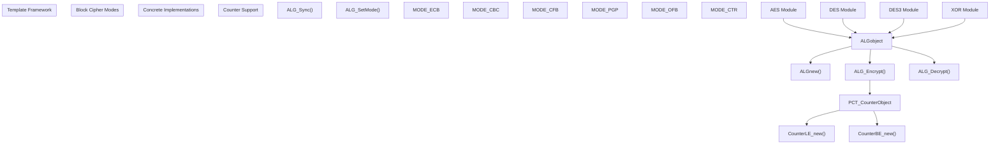

# Core Cryptographic Components

> **Relevant source files**
> * [charm/core/__init__.py](https://github.com/JHUISI/charm/blob/7b52fa53/charm/core/__init__.py)
> * [charm/core/crypto/AES/AES.c](https://github.com/JHUISI/charm/blob/7b52fa53/charm/core/crypto/AES/AES.c)
> * [charm/core/crypto/COMPILED_EXTENSION_MODULES_HERE](https://github.com/JHUISI/charm/blob/7b52fa53/charm/core/crypto/COMPILED_EXTENSION_MODULES_HERE)
> * [charm/core/crypto/DES/DES.c](https://github.com/JHUISI/charm/blob/7b52fa53/charm/core/crypto/DES/DES.c)
> * [charm/core/crypto/DES3/DES3.c](https://github.com/JHUISI/charm/blob/7b52fa53/charm/core/crypto/DES3/DES3.c)
> * [charm/core/crypto/__init__.py](https://github.com/JHUISI/charm/blob/7b52fa53/charm/core/crypto/__init__.py)
> * [charm/core/crypto/cryptobase/XOR.c](https://github.com/JHUISI/charm/blob/7b52fa53/charm/core/crypto/cryptobase/XOR.c)
> * [charm/core/crypto/cryptobase/_counter.c](https://github.com/JHUISI/charm/blob/7b52fa53/charm/core/crypto/cryptobase/_counter.c)
> * [charm/core/crypto/cryptobase/_counter.h](https://github.com/JHUISI/charm/blob/7b52fa53/charm/core/crypto/cryptobase/_counter.h)
> * [charm/core/crypto/cryptobase/block_template.c](https://github.com/JHUISI/charm/blob/7b52fa53/charm/core/crypto/cryptobase/block_template.c)
> * [charm/core/crypto/cryptobase/block_template.h](https://github.com/JHUISI/charm/blob/7b52fa53/charm/core/crypto/cryptobase/block_template.h)
> * [charm/core/crypto/cryptobase/cryptobasemodule.c](https://github.com/JHUISI/charm/blob/7b52fa53/charm/core/crypto/cryptobase/cryptobasemodule.c)
> * [charm/core/math/pairing/relic/pairingmodule3.h](https://github.com/JHUISI/charm/blob/7b52fa53/charm/core/math/pairing/relic/pairingmodule3.h)

## Purpose and Scope

This section documents the shared cryptographic components that form the foundation for Charm-Crypto's cryptographic library backends. These components provide common functionality used across different cryptographic libraries, including block cipher templates, algorithm selection mechanisms, and supporting utilities.

For information about specific backend integrations with RELIC, see [RELIC Integration](/JHUISI/charm/4.1-relic-integration). For MIRACL backend details, see [MIRACL Integration](/JHUISI/charm/4.2-miracl-integration). For higher-level Python cryptographic abstractions, see [Python Cryptographic Framework](/JHUISI/charm/5-python-cryptographic-framework).

## Block Cipher Template Framework

The block cipher template framework provides a generic implementation for block ciphers that can be instantiated with different algorithms. This template handles common block cipher modes of operation and provides a consistent interface.

### Block Cipher Template Architecture



The `ALGobject` structure contains the cipher state and mode information:

| Field | Type | Purpose |
| --- | --- | --- |
| `mode` | `Py_ssize_t` | Current cipher mode (ECB, CBC, etc.) |
| `count` | `Py_ssize_t` | Byte counter for streaming modes |
| `segment_size` | `Py_ssize_t` | Segment size for CFB mode |
| `prf_mode` | `Py_ssize_t` | PRF mode flag |
| `IV` | `unsigned char[BLOCK_SIZE]` | Initialization vector |
| `oldCipher` | `unsigned char[BLOCK_SIZE]` | Previous cipher block |
| `counter` | `PyObject *` | Counter object for CTR mode |
| `st` | `block_state` | Algorithm-specific state |

Sources: [charm/core/crypto/cryptobase/block_template.h L46-L54](https://github.com/JHUISI/charm/blob/7b52fa53/charm/core/crypto/cryptobase/block_template.h#L46-L54)

 [charm/core/crypto/cryptobase/block_template.c L29-L191](https://github.com/JHUISI/charm/blob/7b52fa53/charm/core/crypto/cryptobase/block_template.c#L29-L191)

### Block Cipher Operations

The template framework implements encryption and decryption for all standard block cipher modes:

**Electronic Codebook (ECB) Mode**

```
for(i=0; i<len; i+=BLOCK_SIZE) {
    block_encrypt(&(self->st), str+i, buffer+i);
}
```

**Cipher Block Chaining (CBC) Mode**

```
for(i=0; i<len; i+=BLOCK_SIZE) {
    for(j=0; j<BLOCK_SIZE; j++) {
        temp[j]=str[i+j]^self->IV[j];
    }
    block_encrypt(&(self->st), temp, buffer+i);
    memcpy(self->IV, buffer+i, BLOCK_SIZE);
}
```

**Counter (CTR) Mode** with optimization for fast counters:

```
if (self->counter_shortcut) {
    PCT_CounterObject *ctr = (PCT_CounterObject *)(self->counter);
    block_encrypt(&(self->st), (unsigned char *)ctr->val, self->IV);
    ctr->inc_func(ctr);
}
```

Sources: [charm/core/crypto/cryptobase/block_template.c L244-L434](https://github.com/JHUISI/charm/blob/7b52fa53/charm/core/crypto/cryptobase/block_template.c#L244-L434)

 [charm/core/crypto/cryptobase/block_template.c L511-L619](https://github.com/JHUISI/charm/blob/7b52fa53/charm/core/crypto/cryptobase/block_template.c#L511-L619)

## Cryptographic Base Module

The `cryptobase` module provides algorithm selection and instantiation functions for pseudorandom functions (PRFs) and pseudorandom permutations (PRPs).

### Algorithm Selection Framework

```mermaid
flowchart TD

subgraph Implementation_Modules ["Implementation Modules"]
end

subgraph Algorithm_Constants ["Algorithm Constants"]
end

subgraph Cryptobase_Module ["Cryptobase Module"]
end

subgraph Mode_Constants ["Mode Constants"]
end

MODE_ECB_CONST["MODE_ECB = 1"]
MODE_CBC_CONST["MODE_CBC = 2"]
MODE_CFB_CONST["MODE_CFB = 3"]
MODE_CTR_CONST["MODE_CTR = 6"]
selectPRF["selectPRF()"]
selectPRP["selectPRP()"]
BaseType["BaseType"]
AES_CONST["AES = 0"]
DES_CONST["DES = 1"]
DES3_CONST["DES3 = 2"]
AESNew["charm.core.crypto.AES.new"]
DESNew["charm.core.crypto.DES.new"]
DES3New["charm.core.crypto.DES3.new"]

    selectPRF --> AESNew
    selectPRP --> AESNew
```



The `selectPRF` function creates a PRF by instantiating a block cipher and enabling PRF mode:

| Parameter | Type | Description |
| --- | --- | --- |
| `alg` | `int` | Algorithm identifier (AES, DES, DES3) |
| `tuple` | `PyObject *` | Arguments tuple (key, mode, IV, etc.) |

**Returns**: Configured cipher object with PRF mode enabled

The `selectPRP` function creates a standard block cipher without PRF restrictions:

| Parameter | Type | Description |
| --- | --- | --- |
| `alg` | `int` | Algorithm identifier (AES, DES, DES3) |
| `tuple` | `PyObject *` | Arguments tuple (key, mode, IV, etc.) |

**Returns**: Standard cipher object for encryption/decryption

Sources: [charm/core/crypto/cryptobase/cryptobasemodule.c L22-L99](https://github.com/JHUISI/charm/blob/7b52fa53/charm/core/crypto/cryptobase/cryptobasemodule.c#L22-L99)

 [charm/core/crypto/cryptobase/cryptobasemodule.c L140-L217](https://github.com/JHUISI/charm/blob/7b52fa53/charm/core/crypto/cryptobase/cryptobasemodule.c#L140-L217)

## Counter Mechanisms

The counter implementation provides fast, optimized counter objects for CTR mode encryption. Two variants support different endianness requirements.

### Counter Object Architecture

```mermaid
flowchart TD

subgraph Increment_Functions ["Increment Functions"]
end

subgraph Counter_Fields ["Counter Fields"]
end

subgraph Counter_Types ["Counter Types"]
end

subgraph Constructor_Functions ["Constructor Functions"]
end

CounterLE_new["CounterLE_new()"]
CounterObject_init["CounterObject_init()"]
CounterBE_new["CounterBE_new()"]
PCT_CounterObject["PCT_CounterObject"]
CounterLEType["CounterLEType"]
CounterBEType["CounterBEType"]
prefix["prefix: PyUnicodeObject*"]
suffix["suffix: PyUnicodeObject*"]
val["val: uint8_t*"]
buf_size["buf_size: uint32_t"]
p["p: uint8_t*"]
nbytes["nbytes: uint16_t"]
inc_func["inc_func: void()(void)"]
carry["carry: int"]
allow_wraparound["allow_wraparound: int"]
CounterLEIncrement["CounterLEObject_increment()"]
CounterBEIncrement["CounterBEObject_increment()"]

    CounterLEType --> CounterLEIncrement
    CounterBEType --> CounterBEIncrement
    CounterLEIncrement --> carry
    CounterBEIncrement --> carry
```



### Counter Implementation Details

The counter structure provides efficient counter operations for CTR mode:

| Field | Type | Purpose |
| --- | --- | --- |
| `prefix` | `PyUnicodeObject *` | Nonce prefix |
| `suffix` | `PyUnicodeObject *` | Nonce suffix |
| `val` | `uint8_t *` | Complete counter buffer |
| `p` | `uint8_t *` | Pointer to counter portion |
| `nbytes` | `uint16_t` | Counter field size |
| `inc_func` | `void (*)(void *)` | Increment function pointer |
| `carry` | `int` | Overflow flag |
| `allow_wraparound` | `int` | Wraparound permission |

**Little Endian Increment**:

```
carry = 1;
p = self->p;
for (i = 0; i < self->nbytes; i++, p++) {
    tmp = *p + carry;
    carry = tmp >> 8;
    *p = tmp & 0xff;
}
```

**Big Endian Increment**:

```
carry = 1;
p = self->p + self->nbytes-1;
for (i = 0; i < self->nbytes; i++, p--) {
    tmp = *p + carry;
    carry = tmp >> 8;
    *p = tmp & 0xff;
}
```

Sources: [charm/core/crypto/cryptobase/_counter.h L34-L46](https://github.com/JHUISI/charm/blob/7b52fa53/charm/core/crypto/cryptobase/_counter.h#L34-L46)

 [charm/core/crypto/cryptobase/_counter.c L222-L264](https://github.com/JHUISI/charm/blob/7b52fa53/charm/core/crypto/cryptobase/_counter.c#L222-L264)

## Concrete Algorithm Implementations

### AES Implementation

The AES module implements the Rijndael algorithm with support for all standard key sizes:

| Parameter | Value |
| --- | --- |
| `MODULE_NAME` | `AES` |
| `BLOCK_SIZE` | `16` bytes |
| `KEY_SIZE` | `0` (variable: 128, 192, 256 bits) |

Key structures:

* `block_state`: Contains expanded keys `ek[4*(MAXNR+1)]` and `dk[4*(MAXNR+1)]`
* Round constants and S-boxes: `Te0`, `Te1`, `Te2`, `Te3`, `Te4` for encryption
* Inverse tables: `Td0`, `Td1`, `Td2`, `Td3` for decryption

Sources: [charm/core/crypto/AES/AES.c L36-L52](https://github.com/JHUISI/charm/blob/7b52fa53/charm/core/crypto/AES/AES.c#L36-L52)

### DES/3DES Implementation

The DES modules use LibTomCrypt for the underlying implementation:

| Algorithm | Block Size | Key Size |
| --- | --- | --- |
| DES | 8 bytes | 8 bytes (64-bit with parity) |
| 3DES | 8 bytes | Variable (128 or 192 bits) |

Key functions:

* `des_setup()` / `des3_setup()`: Key scheduling
* `des_ecb_encrypt()` / `des3_ecb_encrypt()`: Block encryption
* `des_ecb_decrypt()` / `des3_ecb_decrypt()`: Block decryption

Sources: [charm/core/crypto/DES/DES.c L65-L98](https://github.com/JHUISI/charm/blob/7b52fa53/charm/core/crypto/DES/DES.c#L65-L98)

 [charm/core/crypto/DES3/DES3.c L25-L26](https://github.com/JHUISI/charm/blob/7b52fa53/charm/core/crypto/DES3/DES3.c#L25-L26)

### XOR Stream Cipher

A simple XOR-based stream cipher for testing and educational purposes:

| Parameter | Value |
| --- | --- |
| `MODULE_NAME` | `XOR` |
| `BLOCK_SIZE` | `1` byte |
| `KEY_SIZE` | `0` (variable, max 32 bytes) |

The implementation maintains a key position counter and XORs input with the repeating key:

```
for(i=0; i<len; i++, j=(j+1) % self->keylen) {
    block[i] ^= self->key[j];
}
```

Sources: [charm/core/crypto/cryptobase/XOR.c L35-L74](https://github.com/JHUISI/charm/blob/7b52fa53/charm/core/crypto/cryptobase/XOR.c#L35-L74)