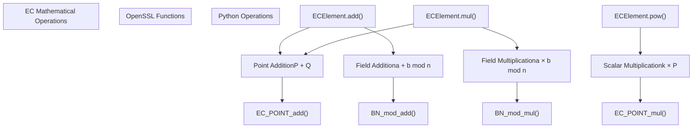
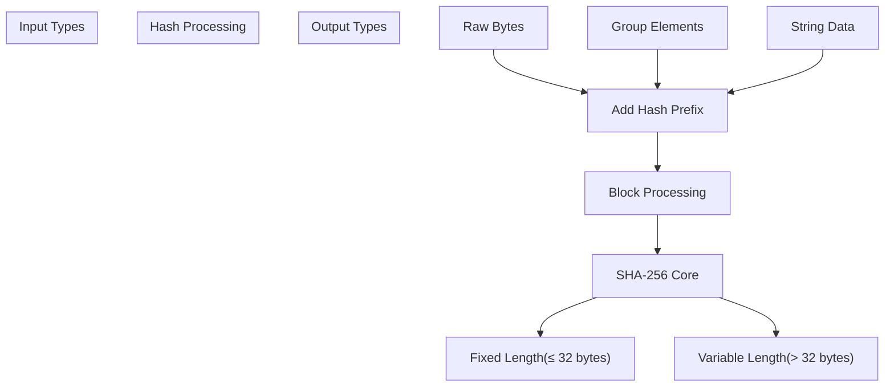
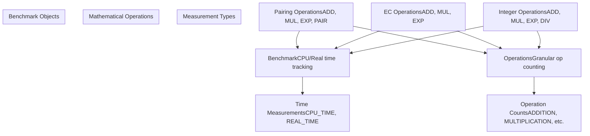

# Core Mathematical Foundation

> **Relevant source files**
> * [charm/core/benchmark/benchmark_util.c](https://github.com/JHUISI/charm/blob/7b52fa53/charm/core/benchmark/benchmark_util.c)
> * [charm/core/benchmark/benchmark_util.h](https://github.com/JHUISI/charm/blob/7b52fa53/charm/core/benchmark/benchmark_util.h)
> * [charm/core/benchmark/benchmarkmodule.c](https://github.com/JHUISI/charm/blob/7b52fa53/charm/core/benchmark/benchmarkmodule.c)
> * [charm/core/benchmark/benchmarkmodule.h](https://github.com/JHUISI/charm/blob/7b52fa53/charm/core/benchmark/benchmarkmodule.h)
> * [charm/core/math/elliptic_curve/ecmodule.c](https://github.com/JHUISI/charm/blob/7b52fa53/charm/core/math/elliptic_curve/ecmodule.c)
> * [charm/core/math/elliptic_curve/ecmodule.h](https://github.com/JHUISI/charm/blob/7b52fa53/charm/core/math/elliptic_curve/ecmodule.h)
> * [charm/core/math/integer/integermodule.c](https://github.com/JHUISI/charm/blob/7b52fa53/charm/core/math/integer/integermodule.c)
> * [charm/core/math/integer/integermodule.h](https://github.com/JHUISI/charm/blob/7b52fa53/charm/core/math/integer/integermodule.h)
> * [charm/core/math/pairing/pairingmodule.c](https://github.com/JHUISI/charm/blob/7b52fa53/charm/core/math/pairing/pairingmodule.c)
> * [charm/core/math/pairing/pairingmodule.h](https://github.com/JHUISI/charm/blob/7b52fa53/charm/core/math/pairing/pairingmodule.h)

The Core Mathematical Foundation provides the fundamental mathematical primitives that power all cryptographic operations in Charm-Crypto. This system implements high-performance C extensions with Python bindings for pairing-based cryptography, elliptic curve operations, and arbitrary-precision integer arithmetic.

For information about cryptographic library backends that power these operations, see [Cryptographic Library Backends](/JHUISI/charm/4-cryptographic-library-backends). For details about the Python abstractions built on top of these foundations, see [Python Cryptographic Framework](/JHUISI/charm/5-python-cryptographic-framework).

## Architecture Overview

The Core Mathematical Foundation consists of three primary C extension modules that provide Python interfaces to established cryptographic libraries:

### Core Module Architecture

```

```

**Sources:** [charm/core/math/pairing/pairingmodule.c L1-L50](https://github.com/JHUISI/charm/blob/7b52fa53/charm/core/math/pairing/pairingmodule.c#L1-L50)

 [charm/core/math/elliptic_curve/ecmodule.c L1-L50](https://github.com/JHUISI/charm/blob/7b52fa53/charm/core/math/elliptic_curve/ecmodule.c#L1-L50)

 [charm/core/math/integer/integermodule.c L1-L50](https://github.com/JHUISI/charm/blob/7b52fa53/charm/core/math/integer/integermodule.c#L1-L50)

 [charm/core/benchmark/benchmarkmodule.c L1-L50](https://github.com/JHUISI/charm/blob/7b52fa53/charm/core/benchmark/benchmarkmodule.c#L1-L50)

### Mathematical Type System

The foundation implements a structured type system for different mathematical objects:

```

```

**Sources:** [charm/core/math/pairing/pairingmodule.h L75-L76](https://github.com/JHUISI/charm/blob/7b52fa53/charm/core/math/pairing/pairingmodule.h#L75-L76)

 [charm/core/math/elliptic_curve/ecmodule.h L85-L86](https://github.com/JHUISI/charm/blob/7b52fa53/charm/core/math/elliptic_curve/ecmodule.h#L85-L86)

 [charm/core/math/integer/integermodule.h L156-L161](https://github.com/JHUISI/charm/blob/7b52fa53/charm/core/math/integer/integermodule.h#L156-L161)

## Pairing-Based Cryptography Module

The pairing module (`pairingmodule.c`) provides the most complex mathematical operations, implementing bilinear pairings over elliptic curves.

### Core Data Structures

The module defines two primary Python types:

**Pairing Group Object:**

```
typedef struct {
    PyObject_HEAD
    pbc_param_t p;              // PBC parameters
    pairing_t pair_obj;         // PBC pairing structure
    char *param_buf;            // Parameter buffer
    int group_init;             // Initialization flag
    uint8_t hash_id[ID_LEN+1];  // Group identifier
} Pairing;
```

**Element Object:**

```
typedef struct {
    PyObject_HEAD
    Pairing *pairing;           // Reference to pairing group
    element_t e;                // PBC element
    GroupType element_type;     // ZR, G1, G2, or GT
    int elem_initialized;       // Initialization flag
    element_pp_t e_pp;          // Preprocessing table
    int elem_initPP;           // Preprocessing flag
} Element;
```

**Sources:** [charm/core/math/pairing/pairingmodule.h L121-L144](https://github.com/JHUISI/charm/blob/7b52fa53/charm/core/math/pairing/pairingmodule.h#L121-L144)

### Group Type System and Operation Rules

The pairing module enforces strict mathematical rules for operations between different group types:

```

```

**Sources:** [charm/core/math/pairing/pairingmodule.c L58-L97](https://github.com/JHUISI/charm/blob/7b52fa53/charm/core/math/pairing/pairingmodule.c#L58-L97)

 [charm/core/math/pairing/pairingmodule.c L204-L228](https://github.com/JHUISI/charm/blob/7b52fa53/charm/core/math/pairing/pairingmodule.c#L204-L228)

### Element Operations Implementation

The pairing module implements mathematical operations through function dispatch based on element types:

| Operation | Function | Rule Implementation |
| --- | --- | --- |
| Addition | `Element_add()` | [charm/core/math/pairing/pairingmodule.c L787-L809](https://github.com/JHUISI/charm/blob/7b52fa53/charm/core/math/pairing/pairingmodule.c#L787-L809) |
| Multiplication | `Element_mul()` | [charm/core/math/pairing/pairingmodule.c L839-L914](https://github.com/JHUISI/charm/blob/7b52fa53/charm/core/math/pairing/pairingmodule.c#L839-L914) |
| Exponentiation | `Element_pow()` | [charm/core/math/pairing/pairingmodule.c L1019-L1113](https://github.com/JHUISI/charm/blob/7b52fa53/charm/core/math/pairing/pairingmodule.c#L1019-L1113) |
| Pairing | `Apply_pairing()` | [charm/core/math/pairing/pairingmodule.c L1248-L1293](https://github.com/JHUISI/charm/blob/7b52fa53/charm/core/math/pairing/pairingmodule.c#L1248-L1293) |

The module uses macro-generated binary operation handlers:

```
#define BINARY(f, m, n) \
static PyObject *f(PyObject *v, PyObject *w) { \
    Element *obj1 = NULL, *obj2 = NULL; \
    int obj1_long = FALSE, obj2_long = FALSE; \
    // Type checking and conversion logic
    if(Check_Types(obj1->element_type, obj2->element_type, m)) { \
        PyObject *obj3 = (n)(obj1, obj2); \
        return obj3; \
    } \
    return NULL; \
}
```

**Sources:** [charm/core/math/pairing/pairingmodule.c L114-L135](https://github.com/JHUISI/charm/blob/7b52fa53/charm/core/math/pairing/pairingmodule.c#L114-L135)

## Elliptic Curve Module

The elliptic curve module (`ecmodule.c`) provides operations over elliptic curves using OpenSSL's implementation.

### EC Data Structures

**EC Group Object:**

```
typedef struct {
    PyObject_HEAD
    EC_GROUP *ec_group;         // OpenSSL EC group
    int group_init;             // Initialization status
    int nid;                    // Curve identifier (NID)
    BN_CTX *ctx;               // OpenSSL context
    BIGNUM *order;             // Group order
} ECGroup;
```

**EC Element Object:**

```
typedef struct {
    PyObject_HEAD
    GroupType type;             // ZR or G
    ECGroup *group;            // Reference to EC group
    EC_POINT *P;               // EC point (for type G)
    BIGNUM *elemZ;             // Field element (for type ZR)
    int point_init;            // Initialization flag
} ECElement;
```

**Sources:** [charm/core/math/elliptic_curve/ecmodule.h L104-L125](https://github.com/JHUISI/charm/blob/7b52fa53/charm/core/math/elliptic_curve/ecmodule.h#L104-L125)

### EC Operation Mapping



**Sources:** [charm/core/math/elliptic_curve/ecmodule.c L485-L905](https://github.com/JHUISI/charm/blob/7b52fa53/charm/core/math/elliptic_curve/ecmodule.c#L485-L905)

### Curve Initialization and Point Generation

The module supports both standard curves and custom curve parameters:

**Standard Curve Initialization:**

```
// Using OpenSSL NID (Numeric Identifier)
self->ec_group = EC_GROUP_new_by_curve_name(nid);
```

**Custom Curve Initialization:**

```
// Using explicit parameters p, a, b for y² = x³ + ax + b (mod p)
self->ec_group = EC_GROUP_new_curve_GFp(p, a, b, self->ctx);
```

**Random Point Generation:**
The module implements a rejection sampling method for generating random EC points:

```
do {
    BN_rand_range(x, gobj->order);
    EC_POINT_set_compressed_coordinates_GFp(gobj->ec_group, objG->P, x, 1, gobj->ctx);
    EC_POINT_get_affine_coordinates_GFp(gobj->ec_group, objG->P, x, y, gobj->ctx);
    if(!BN_is_zero(x) && !BN_is_zero(y) && 
       EC_POINT_is_on_curve(gobj->ec_group, objG->P, gobj->ctx)) {
        FindAnotherPoint = FALSE;
    }
} while(FindAnotherPoint);
```

**Sources:** [charm/core/math/elliptic_curve/ecmodule.c L282-L300](https://github.com/JHUISI/charm/blob/7b52fa53/charm/core/math/elliptic_curve/ecmodule.c#L282-L300)

 [charm/core/math/elliptic_curve/ecmodule.c L267-L278](https://github.com/JHUISI/charm/blob/7b52fa53/charm/core/math/elliptic_curve/ecmodule.c#L267-L278)

 [charm/core/math/elliptic_curve/ecmodule.c L427-L448](https://github.com/JHUISI/charm/blob/7b52fa53/charm/core/math/elliptic_curve/ecmodule.c#L427-L448)

## Integer Arithmetic Module

The integer module (`integermodule.c`) provides arbitrary-precision arithmetic using the GNU Multiple Precision Arithmetic Library (GMP).

### Integer Data Structure

```
typedef struct {
    PyObject_HEAD
    mpz_t m;                    // Modulus (GMP integer)
    mpz_t e;                    // Element value (GMP integer)
    int initialized;            // Initialization flag
} Integer;
```

**Sources:** [charm/core/math/integer/integermodule.h L156-L161](https://github.com/JHUISI/charm/blob/7b52fa53/charm/core/math/integer/integermodule.h#L156-L161)

### Conversion Between Python and GMP

The module implements bidirectional conversion between Python's arbitrary-precision integers and GMP's `mpz_t` format:

**Python Long to GMP:**

```
void longObjToMPZ(mpz_t m, PyObject *o) {
    PyLongObject *p = (PyLongObject *) PyNumber_Long(o);
    int size = Py_SIZE(p);
    // Process Python digit array using PyLong_SHIFT
    for (i = 0; i < size; i++) {
        mpz_set_ui(temp, PythonLongVal(p)[i]);
        mpz_mul_2exp(temp2, temp, PyLong_SHIFT * i);
        mpz_add(m, m, temp2);
    }
}
```

**GMP to Python Long:**

```
PyObject *mpzToLongObj(mpz_t m) {
    int size = (mpz_sizeinbase(m, 2) + PyLong_SHIFT - 1) / PyLong_SHIFT;
    PyLongObject *l = _PyLong_New(size);
    mpz_init_set(temp, m);
    for (i = 0; i < size; i++) {
        PythonLongVal(l)[i] = (digit)(mpz_get_ui(temp) & PyLong_MASK);
        mpz_fdiv_q_2exp(temp, temp, PyLong_SHIFT);
    }
}
```

**Sources:** [charm/core/math/integer/integermodule.c L85-L107](https://github.com/JHUISI/charm/blob/7b52fa53/charm/core/math/integer/integermodule.c#L85-L107)

 [charm/core/math/integer/integermodule.c L167-L191](https://github.com/JHUISI/charm/blob/7b52fa53/charm/core/math/integer/integermodule.c#L167-L191)

### Modular Arithmetic Operations

The integer module supports both regular and modular arithmetic:

| Operation | Regular | Modular | Implementation |
| --- | --- | --- | --- |
| Addition | `mpz_add()` | Implicit via modulus | [charm/core/math/integer/integermodule.c L561-L619](https://github.com/JHUISI/charm/blob/7b52fa53/charm/core/math/integer/integermodule.c#L561-L619) |
| Multiplication | `mpz_mul()` | Implicit via modulus | [charm/core/math/integer/integermodule.c L684-L745](https://github.com/JHUISI/charm/blob/7b52fa53/charm/core/math/integer/integermodule.c#L684-L745) |
| Exponentiation | `mpz_pow_ui()` | `mpz_powm()` | [charm/core/math/integer/integermodule.c L861-L950](https://github.com/JHUISI/charm/blob/7b52fa53/charm/core/math/integer/integermodule.c#L861-L950) |
| Inversion | N/A | `mpz_invert()` | [charm/core/math/integer/integermodule.c L748-L765](https://github.com/JHUISI/charm/blob/7b52fa53/charm/core/math/integer/integermodule.c#L748-L765) |

## Hash Functions and Utilities

All three modules implement standardized hash functions for cryptographic operations:

### Hash Function Framework



**Hash Function Indices:**

* `HASH_FUNCTION_ELEMENTS = 0`: For group elements
* `HASH_FUNCTION_STRINGS = 3`: For string data
* `HASH_FUNCTION_KEM_DERIVE = 2`: For key derivation

**Variable-Length Hash Implementation:**

```
if (hash_len <= HASH_LEN) {
    // Single SHA-256 call
    SHA256_Update(&sha2, new_input, new_input_len);
    SHA256_Final(md, &sha2);
} else {
    // Multiple blocks: SHA-256(0||prefix||input) || SHA-256(1||prefix||input) || ...
    int blocks = (int) ceil(((double) hash_len) / HASH_LEN);
    for(int i = 0; i < blocks; i++) {
        new_input[0] = (uint8_t)(i+1);
        SHA256_Update(&sha2, new_input, new_input_len);
        SHA256_Final(md, &sha2);
        memcpy(md2 +(i * HASH_LEN), md, HASH_LEN);
    }
}
```

**Sources:** [charm/core/math/pairing/pairingmodule.c L380-L424](https://github.com/JHUISI/charm/blob/7b52fa53/charm/core/math/pairing/pairingmodule.c#L380-L424)

 [charm/core/math/elliptic_curve/ecmodule.c L76-L127](https://github.com/JHUISI/charm/blob/7b52fa53/charm/core/math/elliptic_curve/ecmodule.c#L76-L127)

 [charm/core/math/integer/integermodule.c L235-L286](https://github.com/JHUISI/charm/blob/7b52fa53/charm/core/math/integer/integermodule.c#L235-L286)

## Performance Benchmarking Integration

The Core Mathematical Foundation integrates with the benchmarking system to track operation counts and timing:

### Benchmark Integration Architecture



**Benchmark Macro System:**

```
#ifdef BENCHMARK_ENABLED
#define UPDATE_BENCH(op_type, elem_type, bench_obj) \
    if(bench_obj->dBench != NULL && bench_obj->dBench->granular_option == TRUE) { \
        Update_Op(MUL, op_type, elem_type, bench_obj->gBench) \
        Update_Op(EXP, op_type, elem_type, bench_obj->gBench) \
    } \
    UPDATE_BENCHMARK(op_type, bench_obj->dBench);
#endif
```

**Sources:** [charm/core/benchmark/benchmarkmodule.h L75-L101](https://github.com/JHUISI/charm/blob/7b52fa53/charm/core/benchmark/benchmarkmodule.h#L75-L101)

 [charm/core/benchmark/benchmark_util.h L27-L35](https://github.com/JHUISI/charm/blob/7b52fa53/charm/core/benchmark/benchmark_util.h#L27-L35)

 [charm/core/math/pairing/pairingmodule.c L806-L808](https://github.com/JHUISI/charm/blob/7b52fa53/charm/core/math/pairing/pairingmodule.c#L806-L808)

## Library Interface Abstractions

The Core Mathematical Foundation provides abstraction layers over multiple cryptographic libraries:

### Pairing Library Support

| Library | Interface File | Key Functions |
| --- | --- | --- |
| PBC | Direct integration | `element_init_*()`, `element_pairing()` |
| RELIC | `relic_interface.c` | RELIC toolkit wrappers |
| MIRACL | `miracl_interface2.cc` | C++ MIRACL classes |

### OpenSSL Integration

The EC module provides comprehensive OpenSSL integration:

**Curve Support:**

* Standard NIST curves via NID (Numeric Identifier)
* Custom curves with explicit parameters
* Point compression and decompression
* Coordinate conversion between affine and projective

**BIGNUM Operations:**

* Modular arithmetic in prime fields
* Random number generation with proper entropy
* Conversion to/from various formats (decimal, hex, binary)

**Sources:** [charm/core/math/elliptic_curve/ecmodule.c L226-L313](https://github.com/JHUISI/charm/blob/7b52fa53/charm/core/math/elliptic_curve/ecmodule.c#L226-L313)

 [charm/core/math/elliptic_curve/ecmodule.c L44-L65](https://github.com/JHUISI/charm/blob/7b52fa53/charm/core/math/elliptic_curve/ecmodule.c#L44-L65)