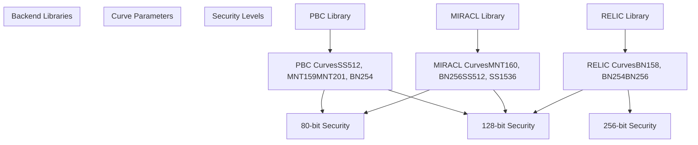
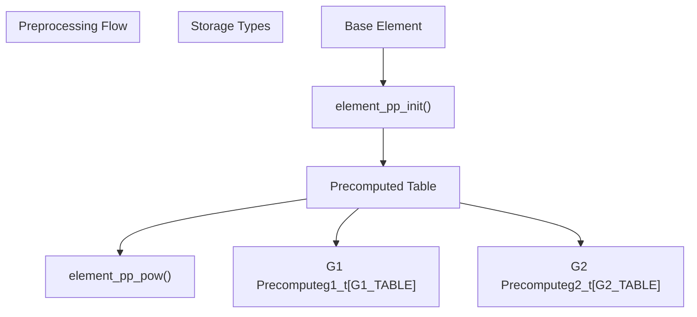

# Cryptographic Library Backends

> **Relevant source files**
> * [charm/core/math/pairing/miracl/bn_pair.patch](https://github.com/JHUISI/charm/blob/7b52fa53/charm/core/math/pairing/miracl/bn_pair.patch)
> * [charm/core/math/pairing/miracl/compile_miracl.sh](https://github.com/JHUISI/charm/blob/7b52fa53/charm/core/math/pairing/miracl/compile_miracl.sh)
> * [charm/core/math/pairing/miracl/miracl_config.h](https://github.com/JHUISI/charm/blob/7b52fa53/charm/core/math/pairing/miracl/miracl_config.h)
> * [charm/core/math/pairing/miracl/miracl_interface2.cc](https://github.com/JHUISI/charm/blob/7b52fa53/charm/core/math/pairing/miracl/miracl_interface2.cc)
> * [charm/core/math/pairing/miracl/miracl_interface2.h](https://github.com/JHUISI/charm/blob/7b52fa53/charm/core/math/pairing/miracl/miracl_interface2.h)
> * [charm/core/math/pairing/miracl/pairing1.patch](https://github.com/JHUISI/charm/blob/7b52fa53/charm/core/math/pairing/miracl/pairing1.patch)
> * [charm/core/math/pairing/miracl/pairingmodule2.c](https://github.com/JHUISI/charm/blob/7b52fa53/charm/core/math/pairing/miracl/pairingmodule2.c)
> * [charm/core/math/pairing/miracl/pairingmodule2.h](https://github.com/JHUISI/charm/blob/7b52fa53/charm/core/math/pairing/miracl/pairingmodule2.h)
> * [charm/core/math/pairing/relic/buildRELIC.sh](https://github.com/JHUISI/charm/blob/7b52fa53/charm/core/math/pairing/relic/buildRELIC.sh)
> * [charm/core/math/pairing/relic/pairingmodule3.c](https://github.com/JHUISI/charm/blob/7b52fa53/charm/core/math/pairing/relic/pairingmodule3.c)
> * [charm/core/math/pairing/relic/relic_interface.c](https://github.com/JHUISI/charm/blob/7b52fa53/charm/core/math/pairing/relic/relic_interface.c)
> * [charm/core/math/pairing/relic/relic_interface.h](https://github.com/JHUISI/charm/blob/7b52fa53/charm/core/math/pairing/relic/relic_interface.h)
> * [charm/core/math/pairing/relic/test_relic.c](https://github.com/JHUISI/charm/blob/7b52fa53/charm/core/math/pairing/relic/test_relic.c)
> * [charm/toolbox/pairingcurves.py](https://github.com/JHUISI/charm/blob/7b52fa53/charm/toolbox/pairingcurves.py)

This document covers the cryptographic library backend integrations that power Charm-Crypto's mathematical operations. These backends provide the core implementations for pairing-based cryptography, elliptic curve operations, and big integer arithmetic. For high-level Python abstractions and group interfaces, see [Python Cryptographic Framework](/JHUISI/charm/5-python-cryptographic-framework). For the core mathematical foundation and Python bindings, see [Core Mathematical Foundation](/JHUISI/charm/3-core-mathematical-foundation).

## Backend Architecture Overview

Charm-Crypto implements a pluggable backend architecture that supports multiple cryptographic libraries through standardized interfaces. Each backend provides implementations for the four main algebraic groups used in pairing-based cryptography.

```

```

**Backend Selection and Configuration**

The backend selection is determined at build time through configuration parameters and library availability.

Sources: [charm/core/math/pairing/relic/pairingmodule3.c L21-L30](https://github.com/JHUISI/charm/blob/7b52fa53/charm/core/math/pairing/relic/pairingmodule3.c#L21-L30)

 [charm/core/math/pairing/miracl/pairingmodule2.c L21-L33](https://github.com/JHUISI/charm/blob/7b52fa53/charm/core/math/pairing/miracl/pairingmodule2.c#L21-L33)

 [charm/toolbox/pairingcurves.py L78-L84](https://github.com/JHUISI/charm/blob/7b52fa53/charm/toolbox/pairingcurves.py#L78-L84)

## RELIC Integration

RELIC (Relic is an Efficient LIbrary for Cryptography) is a modern, high-performance cryptographic library that provides the primary backend for Charm-Crypto's pairing operations.

### RELIC Interface Layer

The RELIC integration consists of a C interface layer that wraps RELIC's native functions and a Python extension module that exposes these operations.

```

```

**Core Data Structures**

The RELIC interface defines a unified `element_t` structure that can represent elements from any of the four algebraic groups:

* **ZR Elements**: Stored as `bn_t` (big numbers) for integers modulo the group order
* **G1/G2 Elements**: Stored as `g1_t`/`g2_t` for elliptic curve points
* **GT Elements**: Stored as `gt_t` for elements in the target group

**Key Operations**

The interface provides comprehensive algebraic operations:

* Group operations: `element_add()`, `element_sub()`, `element_mul()`
* Exponentiation: `element_pow_zr()`, `element_pow_int()`
* Pairing: `pairing_apply()` for bilinear map computation
* Serialization: `element_to_bytes()`, `element_from_bytes()`
* Hashing: `element_from_hash()` for hash-to-curve operations

Sources: [charm/core/math/pairing/relic/relic_interface.h L77-L97](https://github.com/JHUISI/charm/blob/7b52fa53/charm/core/math/pairing/relic/relic_interface.h#L77-L97)

 [charm/core/math/pairing/relic/relic_interface.c L101-L118](https://github.com/JHUISI/charm/blob/7b52fa53/charm/core/math/pairing/relic/relic_interface.c#L101-L118)

 [charm/core/math/pairing/relic/pairingmodule3.c L249-L275](https://github.com/JHUISI/charm/blob/7b52fa53/charm/core/math/pairing/relic/pairingmodule3.c#L249-L275)

### RELIC Build Configuration

RELIC is built with specific optimizations and feature sets through CMake configuration:

```

```

The build configuration enables:

* **GMP Backend**: Uses GNU Multiple Precision Arithmetic Library for big integer operations
* **256-bit Security**: Configured for 256-bit prime fields
* **Optimized Methods**: COMBA multiplication, Montgomery reduction
* **Curve Support**: Elliptic curves with efficient pairing computation

Sources: [charm/core/math/pairing/relic/buildRELIC.sh L14-L16](https://github.com/JHUISI/charm/blob/7b52fa53/charm/core/math/pairing/relic/buildRELIC.sh#L14-L16)

## MIRACL Integration

MIRACL (Multiprecision Integer and Rational Arithmetic C/C++ Library) provides an alternative backend focused on academic use and specific curve implementations.

### MIRACL Interface Architecture

The MIRACL integration uses C++ classes and provides curve-specific implementations for different security levels and curve types.

```

```

**Security Levels and Curves**

MIRACL supports different security levels through specific curve configurations:

| Curve Type | Security Level | Field Size | Embedding Degree |
| --- | --- | --- | --- |
| MNT160 | 80-bit | 160-bit | k=6 |
| BN256 | 128-bit | 256-bit | k=12 |
| SS512 | 80-bit | 512-bit | k=2 |
| SS1536 | 128-bit | 1536-bit | k=2 |

**C++ Class Integration**

The MIRACL backend uses C++ classes for type-safe group operations:

* `Big` class for ZR elements with modular arithmetic
* `G1`/`G2` classes for elliptic curve points with group law
* `GT` class for target group elements with multiplicative structure
* `PFC` class for pairing computation and curve management

Sources: [charm/core/math/pairing/miracl/miracl_interface2.h L38-L48](https://github.com/JHUISI/charm/blob/7b52fa53/charm/core/math/pairing/miracl/miracl_interface2.h#L38-L48)

 [charm/core/math/pairing/miracl/pairingmodule2.h L65-L69](https://github.com/JHUISI/charm/blob/7b52fa53/charm/core/math/pairing/miracl/pairingmodule2.h#L65-L69)

 [charm/core/math/pairing/miracl/miracl_config.h L1-L38](https://github.com/JHUISI/charm/blob/7b52fa53/charm/core/math/pairing/miracl/miracl_config.h#L1-L38)

### MIRACL Build System

MIRACL requires curve-specific compilation with patches for different curve types:

```

```

The build process:

1. **Curve Selection**: Choose MNT, BN, or SS curve family
2. **Patch Application**: Apply curve-specific patches to MIRACL source
3. **Compilation**: Compile with curve-specific optimizations
4. **Library Generation**: Create static libraries for each curve type

Sources: [charm/core/math/pairing/miracl/compile_miracl.sh L11-L46](https://github.com/JHUISI/charm/blob/7b52fa53/charm/core/math/pairing/miracl/compile_miracl.sh#L11-L46)

 [charm/core/math/pairing/miracl/compile_miracl.sh L122-L148](https://github.com/JHUISI/charm/blob/7b52fa53/charm/core/math/pairing/miracl/compile_miracl.sh#L122-L148)

## Core Cryptographic Components

Both backends implement a common set of cryptographic operations through standardized interfaces, providing consistency across different library implementations.

### Element Operations and Type System

The backend system implements a unified type system for cryptographic elements with strict operation rules:

```

```

**Operation Validation Rules**

The backends enforce cryptographic correctness through operation validation:

* **Addition/Subtraction**: Only allowed within the same group (ZR, G1, G2), not in GT
* **Multiplication**: Allowed within groups or scalar multiplication (group × ZR)
* **Exponentiation**: Group elements raised to ZR powers
* **Pairing**: Maps G1 × G2 → GT pairs to target group elements

**Serialization and Hashing**

Both backends provide consistent serialization formats:

* **Binary Serialization**: `element_to_bytes()` / `element_from_bytes()`
* **String Representation**: `element_to_str()` for debugging
* **Hash-to-Curve**: `element_from_hash()` for deterministic element generation

Sources: [charm/core/math/pairing/relic/pairingmodule3.c L32-L71](https://github.com/JHUISI/charm/blob/7b52fa53/charm/core/math/pairing/relic/pairingmodule3.c#L32-L71)

 [charm/core/math/pairing/miracl/pairingmodule2.c L38-L77](https://github.com/JHUISI/charm/blob/7b52fa53/charm/core/math/pairing/miracl/pairingmodule2.c#L38-L77)

 [charm/core/math/pairing/relic/relic_interface.c L835-L865](https://github.com/JHUISI/charm/blob/7b52fa53/charm/core/math/pairing/relic/relic_interface.c#L835-L865)

### Pairing Curve Configuration

The framework supports multiple pairing-friendly curves through a unified configuration system:



**Curve Selection Logic**

The curve selection depends on the backend library and desired security level:

* **PBC Backend**: Supports supersingular (SS), MNT, and Barreto-Naehrig (BN) curves
* **MIRACL Backend**: Optimized implementations for specific curve families
* **RELIC Backend**: Modern BN curves with efficient implementations

Sources: [charm/toolbox/pairingcurves.py L78-L84](https://github.com/JHUISI/charm/blob/7b52fa53/charm/toolbox/pairingcurves.py#L78-L84)

 [charm/core/math/pairing/miracl/miracl_config.h L6-L36](https://github.com/JHUISI/charm/blob/7b52fa53/charm/core/math/pairing/miracl/miracl_config.h#L6-L36)

## Performance and Optimization Features

The backend system includes several optimization mechanisms for high-performance cryptographic operations.

### Preprocessing and Caching

Both backends support element preprocessing for repeated operations:



**Preprocessing Benefits**

* **Repeated Exponentiation**: Precompute tables for base elements used in multiple exponentiations
* **Memory Trade-off**: Exchange memory for computational speed
* **Batch Operations**: Optimize scenarios with many operations on the same base

**Benchmarking Integration**

The backends include optional benchmarking capabilities for performance analysis:

* Operation counting by type and group
* Timing measurements for cryptographic operations
* Memory usage tracking for large-scale deployments

Sources: [charm/core/math/pairing/relic/relic_interface.c L170-L248](https://github.com/JHUISI/charm/blob/7b52fa53/charm/core/math/pairing/relic/relic_interface.c#L170-L248)

 [charm/core/math/pairing/relic/pairingmodule3.c L930-L944](https://github.com/JHUISI/charm/blob/7b52fa53/charm/core/math/pairing/relic/pairingmodule3.c#L930-L944)

 [charm/core/math/pairing/miracl/pairingmodule2.h L102-L126](https://github.com/JHUISI/charm/blob/7b52fa53/charm/core/math/pairing/miracl/pairingmodule2.h#L102-L126)