# Cryptographic Schemes

> **Relevant source files**
> * [.gitignore](https://github.com/JHUISI/charm/blob/7b52fa53/.gitignore)
> * [.travis.yml](https://github.com/JHUISI/charm/blob/7b52fa53/.travis.yml)
> * [VERSION](https://github.com/JHUISI/charm/blob/7b52fa53/VERSION)
> * [charm/adapters/__init__.py](https://github.com/JHUISI/charm/blob/7b52fa53/charm/adapters/__init__.py)
> * [charm/adapters/abenc_adapt_hybrid.py](https://github.com/JHUISI/charm/blob/7b52fa53/charm/adapters/abenc_adapt_hybrid.py)
> * [charm/adapters/dabenc_adapt_hybrid.py](https://github.com/JHUISI/charm/blob/7b52fa53/charm/adapters/dabenc_adapt_hybrid.py)
> * [charm/adapters/ibenc_adapt_hybrid.py](https://github.com/JHUISI/charm/blob/7b52fa53/charm/adapters/ibenc_adapt_hybrid.py)
> * [charm/adapters/kpabenc_adapt_hybrid.py](https://github.com/JHUISI/charm/blob/7b52fa53/charm/adapters/kpabenc_adapt_hybrid.py)
> * [charm/adapters/pkenc_adapt_bchk05.py](https://github.com/JHUISI/charm/blob/7b52fa53/charm/adapters/pkenc_adapt_bchk05.py)
> * [charm/adapters/pkenc_adapt_hybrid.py](https://github.com/JHUISI/charm/blob/7b52fa53/charm/adapters/pkenc_adapt_hybrid.py)
> * [charm/schemes/abenc/abenc_maabe_rw15.py](https://github.com/JHUISI/charm/blob/7b52fa53/charm/schemes/abenc/abenc_maabe_rw15.py)
> * [charm/schemes/abenc/abenc_yllc15.py](https://github.com/JHUISI/charm/blob/7b52fa53/charm/schemes/abenc/abenc_yllc15.py)
> * [charm/schemes/abenc/dabe_aw11.py](https://github.com/JHUISI/charm/blob/7b52fa53/charm/schemes/abenc/dabe_aw11.py)
> * [charm/schemes/encap_bchk05.py](https://github.com/JHUISI/charm/blob/7b52fa53/charm/schemes/encap_bchk05.py)
> * [charm/schemes/ibenc/ibenc_bb03.py](https://github.com/JHUISI/charm/blob/7b52fa53/charm/schemes/ibenc/ibenc_bb03.py)
> * [charm/schemes/ibenc/ibenc_bf01.py](https://github.com/JHUISI/charm/blob/7b52fa53/charm/schemes/ibenc/ibenc_bf01.py)
> * [charm/schemes/ibenc/ibenc_waters05.py](https://github.com/JHUISI/charm/blob/7b52fa53/charm/schemes/ibenc/ibenc_waters05.py)
> * [charm/schemes/pksig/pksig_cl03.py](https://github.com/JHUISI/charm/blob/7b52fa53/charm/schemes/pksig/pksig_cl03.py)
> * [charm/schemes/pksig/pksig_waters.py](https://github.com/JHUISI/charm/blob/7b52fa53/charm/schemes/pksig/pksig_waters.py)
> * [charm/schemes/pksig/pksig_waters05.py](https://github.com/JHUISI/charm/blob/7b52fa53/charm/schemes/pksig/pksig_waters05.py)
> * [charm/test/schemes/abenc/abenc_yllc15_test.py](https://github.com/JHUISI/charm/blob/7b52fa53/charm/test/schemes/abenc/abenc_yllc15_test.py)
> * [charm/test/toolbox/symcrypto_test.py](https://github.com/JHUISI/charm/blob/7b52fa53/charm/test/toolbox/symcrypto_test.py)
> * [charm/test/toolbox/test_policy_expression.py](https://github.com/JHUISI/charm/blob/7b52fa53/charm/test/toolbox/test_policy_expression.py)
> * [charm/toolbox/paddingschemes.py](https://github.com/JHUISI/charm/blob/7b52fa53/charm/toolbox/paddingschemes.py)
> * [charm/toolbox/policy_expression_spec.py](https://github.com/JHUISI/charm/blob/7b52fa53/charm/toolbox/policy_expression_spec.py)
> * [charm/toolbox/symcrypto.py](https://github.com/JHUISI/charm/blob/7b52fa53/charm/toolbox/symcrypto.py)
> * [requirements.txt](https://github.com/JHUISI/charm/blob/7b52fa53/requirements.txt)

This document provides comprehensive coverage of the cryptographic schemes implemented in Charm-Crypto, organized by type and complexity. These schemes form the core application layer of the framework, building upon the mathematical foundations covered in [Core Mathematical Foundation](/JHUISI/charm/3-core-mathematical-foundation) and the Python abstractions detailed in [Python Cryptographic Framework](/JHUISI/charm/5-python-cryptographic-framework).

For information about integrating these schemes into applications, see [Application Development](/JHUISI/charm/7-application-development). For details about the underlying cryptographic library backends that power these schemes, see [Cryptographic Library Backends](/JHUISI/charm/4-cryptographic-library-backends).

## Scheme Organization and Architecture

Charm-Crypto implements cryptographic schemes using a hierarchical class structure that provides consistent interfaces while accommodating the diverse requirements of different cryptographic primitives. The framework organizes schemes into several main categories, each with specialized base classes and common functionality.

### Base Class Hierarchy

```

```

**Sources:** [charm/schemes/abenc/abenc_yllc15.py L17-L45](https://github.com/JHUISI/charm/blob/7b52fa53/charm/schemes/abenc/abenc_yllc15.py#L17-L45)

 [charm/schemes/abenc/abenc_maabe_rw15.py L37-L77](https://github.com/JHUISI/charm/blob/7b52fa53/charm/schemes/abenc/abenc_maabe_rw15.py#L37-L77)

 [charm/schemes/abenc/dabe_aw11.py L20-L45](https://github.com/JHUISI/charm/blob/7b52fa53/charm/schemes/abenc/dabe_aw11.py#L20-L45)

 [charm/schemes/ibenc/ibenc_bf01.py L21-L38](https://github.com/JHUISI/charm/blob/7b52fa53/charm/schemes/ibenc/ibenc_bf01.py#L21-L38)

 [charm/schemes/ibenc/ibenc_bb03.py L21-L39](https://github.com/JHUISI/charm/blob/7b52fa53/charm/schemes/ibenc/ibenc_bb03.py#L21-L39)

 [charm/schemes/pksig/pksig_cl03.py L28-L60](https://github.com/JHUISI/charm/blob/7b52fa53/charm/schemes/pksig/pksig_cl03.py#L28-L60)

### Scheme Interface Patterns

All cryptographic schemes in Charm follow consistent interface patterns that include type annotations and standardized method signatures. The framework uses decorators to enforce input/output types and provide runtime validation.


**Sources:** [charm/schemes/abenc/abenc_yllc15.py L47-L60](https://github.com/JHUISI/charm/blob/7b52fa53/charm/schemes/abenc/abenc_yllc15.py#L47-L60)

 [charm/schemes/abenc/abenc_yllc15.py L62-L69](https://github.com/JHUISI/charm/blob/7b52fa53/charm/schemes/abenc/abenc_yllc15.py#L62-L69)

 [charm/schemes/abenc/abenc_yllc15.py L95-L124](https://github.com/JHUISI/charm/blob/7b52fa53/charm/schemes/abenc/abenc_yllc15.py#L95-L124)

## Attribute-Based Encryption Schemes

Attribute-Based Encryption (ABE) represents one of the most sophisticated categories of schemes implemented in Charm-Crypto. These schemes enable fine-grained access control by encrypting data under access policies expressed as boolean formulas over attributes.

### Core ABE Implementation: YLLC15

The `YLLC15` class implements an extended proxy-assisted attribute-based encryption scheme that supports revocable fine-grained encryption. This scheme demonstrates the typical structure of ABE implementations in Charm.


**Sources:** [charm/schemes/abenc/abenc_yllc15.py L47-L60](https://github.com/JHUISI/charm/blob/7b52fa53/charm/schemes/abenc/abenc_yllc15.py#L47-L60)

 [charm/schemes/abenc/abenc_yllc15.py L62-L69](https://github.com/JHUISI/charm/blob/7b52fa53/charm/schemes/abenc/abenc_yllc15.py#L62-L69)

 [charm/schemes/abenc/abenc_yllc15.py L71-L93](https://github.com/JHUISI/charm/blob/7b52fa53/charm/schemes/abenc/abenc_yllc15.py#L71-L93)

 [charm/schemes/abenc/abenc_yllc15.py L95-L124](https://github.com/JHUISI/charm/blob/7b52fa53/charm/schemes/abenc/abenc_yllc15.py#L95-L124)

### Multi-Authority ABE: MaabeRW15

The `MaabeRW15` scheme implements decentralized attribute-based encryption where multiple authorities can independently manage disjoint sets of attributes without requiring a trusted central authority.

**Sources:** [charm/schemes/abenc/abenc_maabe_rw15.py L37-L89](https://github.com/JHUISI/charm/blob/7b52fa53/charm/schemes/abenc/abenc_maabe_rw15.py#L37-L89)

 [charm/schemes/abenc/abenc_maabe_rw15.py L108-L124](https://github.com/JHUISI/charm/blob/7b52fa53/charm/schemes/abenc/abenc_maabe_rw15.py#L108-L124)

 [charm/schemes/abenc/abenc_maabe_rw15.py L147-L159](https://github.com/JHUISI/charm/blob/7b52fa53/charm/schemes/abenc/abenc_maabe_rw15.py#L147-L159)

### Policy Expression Framework

Charm provides a sophisticated policy expression system that supports complex boolean formulas with proper parsing and evaluation:

| Component | Purpose | Implementation |
| --- | --- | --- |
| `SecretUtil` | Policy parsing and secret sharing | [charm/toolbox/secretutil.py](https://github.com/JHUISI/charm/blob/7b52fa53/charm/toolbox/secretutil.py) |
| `policy_expressions()` | Test data generation | [charm/toolbox/policy_expression_spec.py L36-L37](https://github.com/JHUISI/charm/blob/7b52fa53/charm/toolbox/policy_expression_spec.py#L36-L37) |
| `createPolicy()` | Parse policy strings | Used in encrypt methods |
| `calculateSharesDict()` | Generate secret shares | Used in encrypt methods |

**Sources:** [charm/toolbox/policy_expression_spec.py L36-L42](https://github.com/JHUISI/charm/blob/7b52fa53/charm/toolbox/policy_expression_spec.py#L36-L42)

 [charm/schemes/abenc/abenc_yllc15.py L104-L106](https://github.com/JHUISI/charm/blob/7b52fa53/charm/schemes/abenc/abenc_yllc15.py#L104-L106)

## Identity-Based and Public-Key Encryption

### Identity-Based Encryption Schemes

Charm implements several fundamental IBE schemes that eliminate the need for public-key certificates by using arbitrary strings as public keys.


**Sources:** [charm/schemes/ibenc/ibenc_bf01.py L40-L51](https://github.com/JHUISI/charm/blob/7b52fa53/charm/schemes/ibenc/ibenc_bf01.py#L40-L51)

 [charm/schemes/ibenc/ibenc_bb03.py L41-L51](https://github.com/JHUISI/charm/blob/7b52fa53/charm/schemes/ibenc/ibenc_bb03.py#L41-L51)

 [charm/schemes/ibenc/ibenc_waters05.py L45-L70](https://github.com/JHUISI/charm/blob/7b52fa53/charm/schemes/ibenc/ibenc_waters05.py#L45-L70)

### Hybrid Encryption Adapters

Charm provides hybrid encryption adapters that combine the flexibility of public-key schemes with the efficiency of symmetric encryption. These adapters follow a consistent pattern across different scheme types.


**Sources:** [charm/adapters/abenc_adapt_hybrid.py L35-L41](https://github.com/JHUISI/charm/blob/7b52fa53/charm/adapters/abenc_adapt_hybrid.py#L35-L41)

 [charm/adapters/ibenc_adapt_hybrid.py L37-L44](https://github.com/JHUISI/charm/blob/7b52fa53/charm/adapters/ibenc_adapt_hybrid.py#L37-L44)

 [charm/adapters/pkenc_adapt_hybrid.py L43-L52](https://github.com/JHUISI/charm/blob/7b52fa53/charm/adapters/pkenc_adapt_hybrid.py#L43-L52)

## Symmetric Cryptography Framework

### Symmetric Encryption Abstractions

The symmetric cryptography framework provides high-level abstractions for authenticated encryption with associated data (AEAD) and basic symmetric encryption.


**Sources:** [charm/toolbox/symcrypto.py L90-L118](https://github.com/JHUISI/charm/blob/7b52fa53/charm/toolbox/symcrypto.py#L90-L118)

 [charm/toolbox/symcrypto.py L168-L202](https://github.com/JHUISI/charm/blob/7b52fa53/charm/toolbox/symcrypto.py#L168-L202)

 [charm/toolbox/symcrypto.py L9-L34](https://github.com/JHUISI/charm/blob/7b52fa53/charm/toolbox/symcrypto.py#L9-L34)

### AEAD Implementation Details

The `AuthenticatedCryptoAbstraction` class provides authenticated encryption with associated data, computing MACs over both ciphertext and optional associated data:

| Method | Purpose | Key Features |
| --- | --- | --- |
| `encrypt()` | AEAD encryption | MAC over algorithm + associated data + ciphertext |
| `decrypt()` | AEAD decryption | Verification before decryption |
| MAC computation | `sha2(b'Poor Mans Key Extractor' + key)` | Key derivation for MAC |

**Sources:** [charm/toolbox/symcrypto.py L203-L240](https://github.com/JHUISI/charm/blob/7b52fa53/charm/toolbox/symcrypto.py#L203-L240)

 [charm/toolbox/symcrypto.py L242-L279](https://github.com/JHUISI/charm/blob/7b52fa53/charm/toolbox/symcrypto.py#L242-L279)

## Digital Signature Schemes

### Signature Scheme Implementations

Charm implements several important signature schemes that demonstrate different cryptographic approaches and security assumptions.


**Sources:** [charm/schemes/pksig/pksig_cl03.py L28-L85](https://github.com/JHUISI/charm/blob/7b52fa53/charm/schemes/pksig/pksig_cl03.py#L28-L85)

 [charm/schemes/pksig/pksig_waters.py L20-L55](https://github.com/JHUISI/charm/blob/7b52fa53/charm/schemes/pksig/pksig_waters.py#L20-L55)

 [charm/schemes/pksig/pksig_waters05.py L30-L80](https://github.com/JHUISI/charm/blob/7b52fa53/charm/schemes/pksig/pksig_waters05.py#L30-L80)

### Waters Signature Implementation

The Waters signature scheme demonstrates the use of the Waters hash function and pairing-based operations:


**Sources:** [charm/schemes/pksig/pksig_waters.py L38-L55](https://github.com/JHUISI/charm/blob/7b52fa53/charm/schemes/pksig/pksig_waters.py#L38-L55)

 [charm/schemes/pksig/pksig_waters.py L57-L64](https://github.com/JHUISI/charm/blob/7b52fa53/charm/schemes/pksig/pksig_waters.py#L57-L64)

 [charm/schemes/pksig/pksig_waters.py L66-L75](https://github.com/JHUISI/charm/blob/7b52fa53/charm/schemes/pksig/pksig_waters.py#L66-L75)

 [charm/schemes/pksig/pksig_waters.py L77-L89](https://github.com/JHUISI/charm/blob/7b52fa53/charm/schemes/pksig/pksig_waters.py#L77-L89)

## Testing and Validation Infrastructure

### Property-Based Testing Framework

Charm uses Hypothesis for property-based testing, particularly for complex schemes like ABE that involve policy expressions and attribute management.

```mermaid
flowchart TD

HypothesisFramework["Hypothesis FrameworkProperty-based testing"]
PolicyGeneration["Policy Expression Generationpolicy_expressions()"]
AttributeGeneration["Attribute Generationattributes()"]
YLLC15Tests["YLLC15Testabenc_yllc15_test.py"]
PropertyTests["Property Tests@given decorators"]
RoundTripTests["Round-trip Testsencrypt → decrypt"]
PolicyValidation["Policy Validationassert_valid()"]
AttributeDeduplication["Attribute Processinguppercase, deduplication"]

    HypothesisFramework --> PolicyGeneration
    HypothesisFramework --> AttributeGeneration
    PolicyGeneration --> YLLC15Tests
    AttributeGeneration --> YLLC15Tests
    YLLC15Tests --> PropertyTests
    PropertyTests --> RoundTripTests
    PropertyTests --> PolicyValidation
    PropertyTests --> AttributeDeduplication
```



**Sources:** [charm/test/schemes/abenc/abenc_yllc15_test.py L8-L14](https://github.com/JHUISI/charm/blob/7b52fa53/charm/test/schemes/abenc/abenc_yllc15_test.py#L8-L14)

 [charm/test/schemes/abenc/abenc_yllc15_test.py L28-L35](https://github.com/JHUISI/charm/blob/7b52fa53/charm/test/schemes/abenc/abenc_yllc15_test.py#L28-L35)

 [charm/test/schemes/abenc/abenc_yllc15_test.py L37-L49](https://github.com/JHUISI/charm/blob/7b52fa53/charm/test/schemes/abenc/abenc_yllc15_test.py#L37-L49)

### Test Coverage and Validation

The testing infrastructure provides comprehensive coverage of scheme functionality:

| Test Type | Coverage | Implementation |
| --- | --- | --- |
| Unit Tests | Basic functionality | `unittest.TestCase` classes |
| Property Tests | Edge cases and invariants | `@given` decorators with Hypothesis |
| Round-trip Tests | Encrypt/decrypt cycles | Automated with property generation |
| Policy Tests | Policy expression parsing | `policy_expressions()` strategy |

**Sources:** [charm/test/schemes/abenc/abenc_yllc15_test.py L37-L49](https://github.com/JHUISI/charm/blob/7b52fa53/charm/test/schemes/abenc/abenc_yllc15_test.py#L37-L49)

 [charm/test/toolbox/test_policy_expression.py L10-L16](https://github.com/JHUISI/charm/blob/7b52fa53/charm/test/toolbox/test_policy_expression.py#L10-L16)

 [charm/test/toolbox/symcrypto_test.py L5-L34](https://github.com/JHUISI/charm/blob/7b52fa53/charm/test/toolbox/symcrypto_test.py#L5-L34)

## Integration Patterns and Usage

### Scheme Instantiation Pattern

All cryptographic schemes follow a consistent instantiation and usage pattern that ensures proper initialization and parameter management:

```
# Standard pattern across all schemes
group = PairingGroup('SS512')
scheme = SchemeClass(group)
(public_params, master_secret) = scheme.setup()
```

**Sources:** [charm/schemes/abenc/abenc_yllc15.py L19-L22](https://github.com/JHUISI/charm/blob/7b52fa53/charm/schemes/abenc/abenc_yllc15.py#L19-L22)

 [charm/adapters/abenc_adapt_hybrid.py L47-L51](https://github.com/JHUISI/charm/blob/7b52fa53/charm/adapters/abenc_adapt_hybrid.py#L47-L51)

This comprehensive implementation of cryptographic schemes demonstrates Charm-Crypto's capability to support rapid prototyping and implementation of advanced cryptographic primitives, with robust testing infrastructure and consistent interfaces that facilitate both research and practical applications.