# Digital Signatures and Advanced Schemes

> **Relevant source files**
> * [charm/schemes/abenc/abenc_dacmacs_yj14.py](https://github.com/JHUISI/charm/blob/7b52fa53/charm/schemes/abenc/abenc_dacmacs_yj14.py)
> * [charm/schemes/abenc/abenc_maabe_yj14.py](https://github.com/JHUISI/charm/blob/7b52fa53/charm/schemes/abenc/abenc_maabe_yj14.py)
> * [charm/schemes/abenc/abenc_tbpre_lww14.py](https://github.com/JHUISI/charm/blob/7b52fa53/charm/schemes/abenc/abenc_tbpre_lww14.py)
> * [charm/schemes/aggrsign_bls.py](https://github.com/JHUISI/charm/blob/7b52fa53/charm/schemes/aggrsign_bls.py)
> * [charm/schemes/chamhash_adm05.py](https://github.com/JHUISI/charm/blob/7b52fa53/charm/schemes/chamhash_adm05.py)
> * [charm/schemes/lem_scheme.py](https://github.com/JHUISI/charm/blob/7b52fa53/charm/schemes/lem_scheme.py)
> * [charm/schemes/pksig/pksig_bls04.py](https://github.com/JHUISI/charm/blob/7b52fa53/charm/schemes/pksig/pksig_bls04.py)
> * [charm/schemes/pksig/pksig_ps01.py](https://github.com/JHUISI/charm/blob/7b52fa53/charm/schemes/pksig/pksig_ps01.py)
> * [charm/schemes/pksig/pksig_ps02.py](https://github.com/JHUISI/charm/blob/7b52fa53/charm/schemes/pksig/pksig_ps02.py)
> * [charm/schemes/pksig/pksig_ps03.py](https://github.com/JHUISI/charm/blob/7b52fa53/charm/schemes/pksig/pksig_ps03.py)

This section documents the implementation of digital signature schemes and advanced cryptographic primitives in Charm-Crypto. It covers BLS signature aggregation, Pointcheval-Sanders signatures, chameleon hashing, and privacy-preserving aggregation schemes. These schemes build upon the core mathematical foundations documented in [Core Mathematical Foundation](/JHUISI/charm/3-core-mathematical-foundation) and utilize the pairing-based cryptography and elliptic curve operations provided by the framework.

For basic public-key encryption and identity-based encryption schemes, see [Symmetric Cryptography and PKI Schemes](/JHUISI/charm/6.2-symmetric-cryptography-and-pki-schemes). For attribute-based encryption implementations, see [Attribute-Based Encryption](/JHUISI/charm/6.1-attribute-based-encryption).

## BLS Signature Aggregation

The framework implements BLS (Boneh-Lynn-Shacham) signature aggregation with both vulnerable and secure variants. The `BLSAggregation` class provides comprehensive signature aggregation functionality with protection against rogue public key attacks.

### BLS Aggregation Architecture

```

```

### Vulnerability and Attack Protection

The BLS aggregation implementation demonstrates both vulnerable and secure aggregation methods. The vulnerable version is susceptible to rogue public key attacks, while the secure version uses key hashing to prevent such attacks.

```

```

Sources: [charm/schemes/aggrsign_bls.py L21-L104](https://github.com/JHUISI/charm/blob/7b52fa53/charm/schemes/aggrsign_bls.py#L21-L104)

 [charm/schemes/aggrsign_bls.py L150-L177](https://github.com/JHUISI/charm/blob/7b52fa53/charm/schemes/aggrsign_bls.py#L150-L177)

 [charm/schemes/aggrsign_bls.py L224-L251](https://github.com/JHUISI/charm/blob/7b52fa53/charm/schemes/aggrsign_bls.py#L224-L251)

## Core BLS Identity-Based Signatures

The `BLS01` class implements the foundational BLS identity-based signature scheme, providing the base functionality for more advanced aggregation schemes.

### BLS01 Implementation Structure

```

```

Sources: [charm/schemes/pksig/pksig_bls04.py L23-L59](https://github.com/JHUISI/charm/blob/7b52fa53/charm/schemes/pksig/pksig_bls04.py#L23-L59)

## Pointcheval-Sanders Signatures

The framework implements multiple variants of Pointcheval-Sanders (PS) signatures, each designed for different use cases including signatures over known messages, committed messages, and sequential aggregation.

### PS Signature Variants Overview

```

```

### PS Signature Mathematical Structure

```

```

Sources: [charm/schemes/pksig/pksig_ps01.py L21-L61](https://github.com/JHUISI/charm/blob/7b52fa53/charm/schemes/pksig/pksig_ps01.py#L21-L61)

 [charm/schemes/pksig/pksig_ps02.py L21-L81](https://github.com/JHUISI/charm/blob/7b52fa53/charm/schemes/pksig/pksig_ps02.py#L21-L81)

 [charm/schemes/pksig/pksig_ps03.py L21-L72](https://github.com/JHUISI/charm/blob/7b52fa53/charm/schemes/pksig/pksig_ps03.py#L21-L72)

## Chameleon Hashing

The `ChamHash_Adm05` class implements the Ateneise-Medeiros chameleon hash function, which allows efficient collision finding with a trapdoor key while remaining collision-resistant without the trapdoor.

### Chameleon Hash Architecture

```

```

### Chameleon Hash Security Properties

| Property | Description | Implementation |
| --- | --- | --- |
| **Collision Resistance** | Hard to find collisions without trapdoor | Based on discrete logarithm assumption |
| **Trapdoor Collision** | Easy to find collisions with secret key | `find_collision()` method uses secret key `x` |
| **Uniformity** | Hash values are uniformly distributed | Random values `r` and `s` ensure uniformity |
| **Efficiency** | Fast computation and verification | Uses modular exponentiation in Schnorr groups |

Sources: [charm/schemes/chamhash_adm05.py L21-L76](https://github.com/JHUISI/charm/blob/7b52fa53/charm/schemes/chamhash_adm05.py#L21-L76)

## Privacy-Preserving Aggregation

The framework includes an advanced aggregation scheme for privacy-preserving time-series data aggregation with trust relaxation, implemented across multiple classes that work together.

### Aggregation Scheme Components


### Aggregation Protocol Flow

```mermaid
sequenceDiagram
  participant A
  participant U
  participant C

  Note over A,U: Generate ska, compute pka = ht^ska mod n2
  Note over U: Generate ski (secret key)
  U->C: Encrypt data: encryptfunc(data, ski)
  C->A: Generate auxiliary: auxiliaryfunc(ski)
  Note over C: Compute auxt = Π(auxiliary values) mod n2
  Note over A,U: Decrypt: compute product of encrypted values
  Note over A: Apply trapdoor with ska to recover sum
```



Sources: [charm/schemes/lem_scheme.py L70-L202](https://github.com/JHUISI/charm/blob/7b52fa53/charm/schemes/lem_scheme.py#L70-L202)

## Integration with Charm Framework

All signature and advanced schemes integrate with Charm's core mathematical foundation through standardized interfaces and shared cryptographic primitives.

### Framework Integration Architecture


Sources: [charm/schemes/aggrsign_bls.py L15-L16](https://github.com/JHUISI/charm/blob/7b52fa53/charm/schemes/aggrsign_bls.py#L15-L16)

 [charm/schemes/pksig/pksig_bls04.py L15-L17](https://github.com/JHUISI/charm/blob/7b52fa53/charm/schemes/pksig/pksig_bls04.py#L15-L17)

 [charm/schemes/pksig/pksig_ps01.py L15-L16](https://github.com/JHUISI/charm/blob/7b52fa53/charm/schemes/pksig/pksig_ps01.py#L15-L16)

 [charm/schemes/chamhash_adm05.py L15-L17](https://github.com/JHUISI/charm/blob/7b52fa53/charm/schemes/chamhash_adm05.py#L15-L17)

 [charm/schemes/lem_scheme.py L18-L40](https://github.com/JHUISI/charm/blob/7b52fa53/charm/schemes/lem_scheme.py#L18-L40)