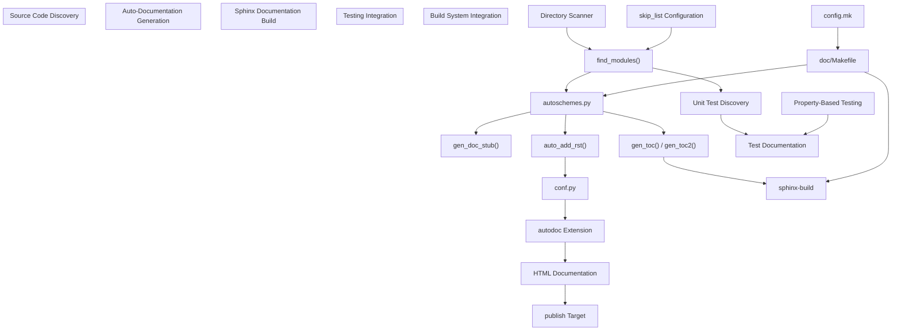
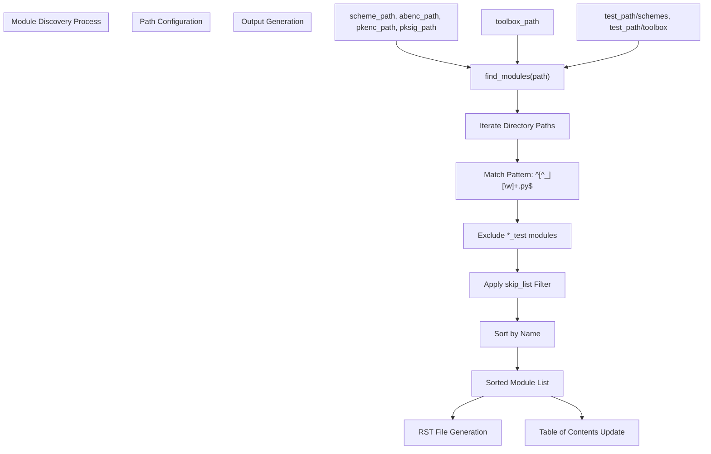
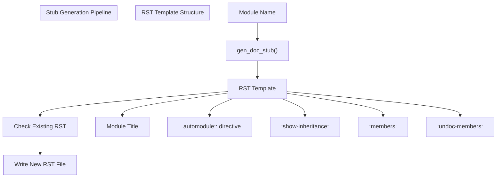
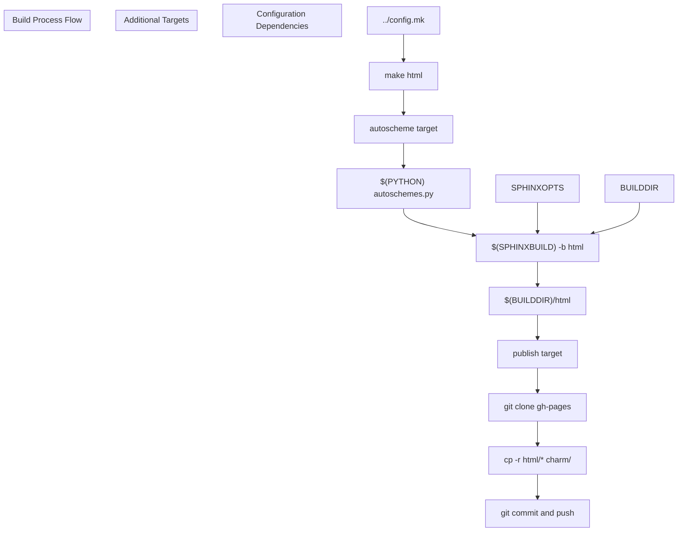
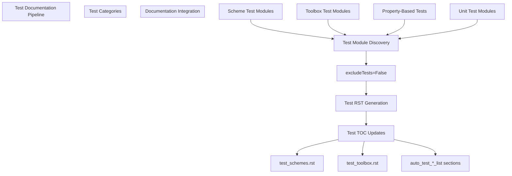
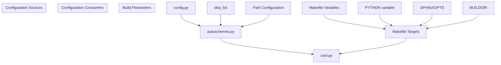

# Documentation and Testing System

> **Relevant source files**
> * [doc/Makefile](https://github.com/JHUISI/charm/blob/7b52fa53/doc/Makefile)
> * [doc/autoschemes.py](https://github.com/JHUISI/charm/blob/7b52fa53/doc/autoschemes.py)
> * [doc/config.py](https://github.com/JHUISI/charm/blob/7b52fa53/doc/config.py)
> * [doc/source/conf.py](https://github.com/JHUISI/charm/blob/7b52fa53/doc/source/conf.py)
> * [doc/source/index.rst](https://github.com/JHUISI/charm/blob/7b52fa53/doc/source/index.rst)
> * [doc/source/install_source.rst](https://github.com/JHUISI/charm/blob/7b52fa53/doc/source/install_source.rst)
> * [doc/source/schemes.rst](https://github.com/JHUISI/charm/blob/7b52fa53/doc/source/schemes.rst)
> * [doc/source/toolbox.rst](https://github.com/JHUISI/charm/blob/7b52fa53/doc/source/toolbox.rst)
> * [doc/source/tutorial.rst](https://github.com/JHUISI/charm/blob/7b52fa53/doc/source/tutorial.rst)

This document covers Charm-Crypto's meta-systems for maintaining code documentation and ensuring software quality. The documentation system automatically generates API documentation from source code, while the testing framework provides comprehensive validation of cryptographic schemes and toolbox components.

For information about the core cryptographic schemes being documented and tested, see [Cryptographic Schemes](/JHUISI/charm/6-cryptographic-schemes). For details about the build and installation processes that integrate with these systems, see [Installation and Build System](/JHUISI/charm/2-installation-and-build-system).

## System Overview

Charm-Crypto employs an automated documentation and testing infrastructure that ensures comprehensive coverage of all implemented cryptographic schemes and toolbox components. The system automatically discovers new code modules, generates documentation stubs, and integrates with continuous testing workflows.

**Sources:** [doc/autoschemes.py L1-L149](https://github.com/JHUISI/charm/blob/7b52fa53/doc/autoschemes.py#L1-L149)

 [doc/source/conf.py L1-L261](https://github.com/JHUISI/charm/blob/7b52fa53/doc/source/conf.py#L1-L261)

 [doc/Makefile L1-L162](https://github.com/JHUISI/charm/blob/7b52fa53/doc/Makefile#L1-L162)

## Automatic Documentation Generation

The automatic documentation generation system discovers Python modules across the codebase and creates standardized documentation stubs using Sphinx's autodoc functionality.

### Module Discovery Engine

The `find_modules()` function in `autoschemes.py` serves as the core discovery engine, scanning specified directories for Python modules while respecting exclusion rules.

**Sources:** [doc/autoschemes.py L11-L31](https://github.com/JHUISI/charm/blob/7b52fa53/doc/autoschemes.py#L11-L31)

 [doc/config.py L1-L18](https://github.com/JHUISI/charm/blob/7b52fa53/doc/config.py#L1-L18)

### Documentation Stub Generation

The system automatically creates reStructuredText (RST) documentation files for undocumented modules using a standardized template that leverages Sphinx's autodoc capabilities.

**Sources:** [doc/autoschemes.py L91-L116](https://github.com/JHUISI/charm/blob/7b52fa53/doc/autoschemes.py#L91-L116)

### Table of Contents Management

The system automatically maintains table of contents sections in documentation index files by replacing marked sections with current module listings.

| Function | Purpose | Target Files |
| --- | --- | --- |
| `gen_toc()` | Generate simple TOC for single directory | Single module directory |
| `gen_toc2()` | Generate hierarchical TOC for multiple directories | Multi-directory schemes |
| `replace_toc()` | Update existing TOC sections | toolbox.rst, test files |
| `replace_toc2()` | Update hierarchical TOC sections | schemes.rst |

**Sources:** [doc/autoschemes.py L33-L89](https://github.com/JHUISI/charm/blob/7b52fa53/doc/autoschemes.py#L33-L89)

## Sphinx Build System Integration

Charm-Crypto uses Sphinx as its documentation generation engine, with extensive configuration for automatic API documentation extraction and cross-referencing.

### Sphinx Configuration Architecture

The `conf.py` file configures Sphinx for comprehensive documentation generation across all Charm-Crypto components.

```mermaid
flowchart TD

subgraph Build_Targets ["Build Targets"]
end

subgraph Extension_Configuration ["Extension Configuration"]
end

subgraph Path_Configuration ["Path Configuration"]
end

subgraph Sphinx_Configuration_Structure ["Sphinx Configuration Structure"]
end

SysPath["System Path Configuration"]
Extensions["Sphinx Extensions"]
AutoDoc["Autodoc Settings"]
OutputFormats["Output Format Configuration"]
RootPath["../../ (Root Directory)"]
SchemePaths["../../charm/schemes/*"]
ToolboxPath["../../charm/toolbox"]
TestPaths["../../charm/test/*"]
AutoDocExt["sphinx.ext.autodoc"]
TodoExt["sphinx.ext.todo"]
CoverageExt["sphinx.ext.coverage"]
MathExt["sphinx.ext.pngmath"]
ViewCodeExt["sphinx.ext.viewcode"]
HtmlBuild["HTML Documentation"]
LatexBuild["LaTeX/PDF Output"]
ManPages["Manual Pages"]
EpubBuild["EPUB Output"]

    SysPath --> RootPath
    SysPath --> SchemePaths
    SysPath --> ToolboxPath
    SysPath --> TestPaths
    Extensions --> AutoDocExt
    Extensions --> TodoExt
    Extensions --> CoverageExt
    Extensions --> MathExt
    Extensions --> ViewCodeExt
    AutoDoc --> HtmlBuild
    AutoDoc --> LatexBuild
    AutoDoc --> ManPages
    AutoDoc --> EpubBuild
```

**Sources:** [doc/source/conf.py L15-L44](https://github.com/JHUISI/charm/blob/7b52fa53/doc/source/conf.py#L15-L44)

 [doc/source/conf.py L189-L261](https://github.com/JHUISI/charm/blob/7b52fa53/doc/source/conf.py#L189-L261)

### Documentation Build Pipeline

The Makefile orchestrates the complete documentation build process, integrating automatic discovery with Sphinx generation.

**Sources:** [doc/Makefile L42-L56](https://github.com/JHUISI/charm/blob/7b52fa53/doc/Makefile#L42-L56)

 [doc/Makefile L45-L46](https://github.com/JHUISI/charm/blob/7b52fa53/doc/Makefile#L45-L46)

## Testing Framework Integration

The documentation system includes comprehensive testing infrastructure that ensures both code quality and documentation completeness.

### Test Discovery and Documentation

The system automatically discovers and documents test modules alongside the main codebase, providing visibility into testing coverage and methodologies.

| Test Category | Path | Documentation Target |
| --- | --- | --- |
| Scheme Tests | `charm/test/schemes` | `test_schemes.rst` |
| Toolbox Tests | `charm/test/toolbox` | `test_toolbox.rst` |
| Property-Based Tests | Various modules | Integrated documentation |
| Unit Tests | Module-specific | Auto-generated stubs |

**Sources:** [doc/autoschemes.py L139-L148](https://github.com/JHUISI/charm/blob/7b52fa53/doc/autoschemes.py#L139-L148)

 [doc/source/conf.py L33-L35](https://github.com/JHUISI/charm/blob/7b52fa53/doc/source/conf.py#L33-L35)

## Development Workflow Integration

The documentation and testing system integrates seamlessly with Charm-Crypto's development workflow, automatically maintaining documentation currency as the codebase evolves.

### Continuous Documentation Updates

The system ensures that documentation remains synchronized with code changes through automated discovery and generation processes that run as part of the build pipeline.

| Workflow Stage | Automation | Output |
| --- | --- | --- |
| Code Addition | Module discovery via `find_modules()` | New RST stubs |
| Documentation Build | `make html` target | Updated HTML docs |
| Testing Integration | Test discovery and documentation | Test coverage docs |
| Publication | `make publish` target | GitHub Pages deployment |

### Configuration Management

The documentation system uses centralized configuration to manage paths, exclusions, and build parameters across different components.

**Sources:** [doc/config.py L1-L18](https://github.com/JHUISI/charm/blob/7b52fa53/doc/config.py#L1-L18)

 [doc/Makefile L3-L16](https://github.com/JHUISI/charm/blob/7b52fa53/doc/Makefile#L3-L16)

 [doc/autoschemes.py L117-L148](https://github.com/JHUISI/charm/blob/7b52fa53/doc/autoschemes.py#L117-L148)

The documentation and testing system provides a robust foundation for maintaining high-quality documentation and ensuring code reliability across the entire Charm-Crypto framework. The automated processes reduce maintenance overhead while ensuring comprehensive coverage of all framework components.