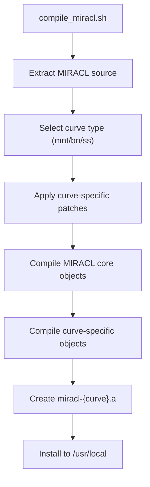

# MIRACL Integration

> **Relevant source files**
> * [charm/core/math/pairing/miracl/compile_miracl.sh](https://github.com/JHUISI/charm/blob/7b52fa53/charm/core/math/pairing/miracl/compile_miracl.sh)
> * [charm/core/math/pairing/miracl/miracl_config.h](https://github.com/JHUISI/charm/blob/7b52fa53/charm/core/math/pairing/miracl/miracl_config.h)
> * [charm/core/math/pairing/miracl/miracl_interface2.cc](https://github.com/JHUISI/charm/blob/7b52fa53/charm/core/math/pairing/miracl/miracl_interface2.cc)
> * [charm/core/math/pairing/miracl/miracl_interface2.h](https://github.com/JHUISI/charm/blob/7b52fa53/charm/core/math/pairing/miracl/miracl_interface2.h)
> * [charm/core/math/pairing/miracl/pairing1.patch](https://github.com/JHUISI/charm/blob/7b52fa53/charm/core/math/pairing/miracl/pairing1.patch)
> * [charm/core/math/pairing/miracl/pairingmodule2.c](https://github.com/JHUISI/charm/blob/7b52fa53/charm/core/math/pairing/miracl/pairingmodule2.c)
> * [charm/core/math/pairing/miracl/pairingmodule2.h](https://github.com/JHUISI/charm/blob/7b52fa53/charm/core/math/pairing/miracl/pairingmodule2.h)
> * [charm/toolbox/pairingcurves.py](https://github.com/JHUISI/charm/blob/7b52fa53/charm/toolbox/pairingcurves.py)

## Purpose and Scope

The MIRACL integration provides Charm-Crypto with access to MIRACL's commercial pairing-based cryptography library as an alternative backend to PBC and RELIC. This integration enables high-performance pairing operations on multiple elliptic curve types including MNT, BN, and supersingular curves with security levels from 80 to 128 bits.

For information about other pairing backends, see [RELIC Integration](/JHUISI/charm/4.1-relic-integration). For the core mathematical foundation that these backends support, see [Core Mathematical Foundation](/JHUISI/charm/3-core-mathematical-foundation).

## Architecture Overview

The MIRACL integration follows a multi-layered architecture that bridges Python code to MIRACL's C++ implementation:

```

```

Sources: [charm/core/math/pairing/miracl/pairingmodule2.c L1-L2000](https://github.com/JHUISI/charm/blob/7b52fa53/charm/core/math/pairing/miracl/pairingmodule2.c#L1-L2000)

 [charm/core/math/pairing/miracl/miracl_interface2.cc L1-L1200](https://github.com/JHUISI/charm/blob/7b52fa53/charm/core/math/pairing/miracl/miracl_interface2.cc#L1-L1200)

## Component Overview

### Core Data Structures

The integration defines two primary Python object types that wrap MIRACL functionality:

| Component | Purpose | MIRACL Mapping |
| --- | --- | --- |
| `Pairing` | Represents pairing context and curve parameters | Wraps MIRACL `PFC` class |
| `Element` | Represents group elements in G1, G2, GT, or ZR | Wraps MIRACL `G1`, `G2`, `GT`, `Big` classes |

```

```

Sources: [charm/core/math/pairing/miracl/pairingmodule2.h L115-L135](https://github.com/JHUISI/charm/blob/7b52fa53/charm/core/math/pairing/miracl/pairingmodule2.h#L115-L135)

 [charm/core/math/pairing/miracl/miracl_interface2.h L31-L48](https://github.com/JHUISI/charm/blob/7b52fa53/charm/core/math/pairing/miracl/miracl_interface2.h#L31-L48)

## Integration Layers

### Python C Extension Layer

The `pairingmodule2.c` file implements the Python C extension that provides the main API surface. Key functions include:

* **Initialization**: `Pairing_init()` creates pairing contexts for specific security levels
* **Element Creation**: `Element_elem()` and `Element_random()` create group elements
* **Arithmetic Operations**: `Element_add()`, `Element_mul()`, `Element_pow()` perform group operations
* **Pairing Operations**: `Apply_pairing()` computes bilinear pairings
* **Serialization**: Element conversion to/from bytes and strings

```

```

Sources: [charm/core/math/pairing/miracl/pairingmodule2.c L435-L471](https://github.com/JHUISI/charm/blob/7b52fa53/charm/core/math/pairing/miracl/pairingmodule2.c#L435-L471)

 [charm/core/math/pairing/miracl/pairingmodule2.c L605-L632](https://github.com/JHUISI/charm/blob/7b52fa53/charm/core/math/pairing/miracl/pairingmodule2.c#L605-L632)

 [charm/core/math/pairing/miracl/pairingmodule2.c L1102-L1141](https://github.com/JHUISI/charm/blob/7b52fa53/charm/core/math/pairing/miracl/pairingmodule2.c#L1102-L1141)

### C++ Interface Layer

The `miracl_interface2.cc` file provides a C-compatible wrapper around MIRACL's C++ classes. This layer handles:

* **Type Conversions**: Converting between C types and MIRACL C++ objects
* **Memory Management**: Proper allocation/deallocation of MIRACL objects
* **Operation Implementation**: Core mathematical operations on group elements
* **Serialization Support**: Converting elements to/from byte representations

Key interface functions:

* `pairing_init()` - Initialize pairing with security level
* `_element_add()`, `_element_mul()`, `_element_div()` - Group operations
* `_element_pairing()` - Bilinear pairing computation
* `_element_to_bytes()`, `_element_from_bytes()` - Serialization

Sources: [charm/core/math/pairing/miracl/miracl_interface2.cc L118-L133](https://github.com/JHUISI/charm/blob/7b52fa53/charm/core/math/pairing/miracl/miracl_interface2.cc#L118-L133)

 [charm/core/math/pairing/miracl/miracl_interface2.cc L347-L438](https://github.com/JHUISI/charm/blob/7b52fa53/charm/core/math/pairing/miracl/miracl_interface2.cc#L347-L438)

 [charm/core/math/pairing/miracl/miracl_interface2.cc L993-L1020](https://github.com/JHUISI/charm/blob/7b52fa53/charm/core/math/pairing/miracl/miracl_interface2.cc#L993-L1020)

## Supported Curves and Security Levels

The MIRACL integration supports three families of pairing-friendly curves:

| Curve Family | Security Level | Curve Name | Embedding Degree |
| --- | --- | --- | --- |
| MNT | 80 bits | MNT160 | k=6 |
| BN | 128 bits | BN256 | k=12 |
| SS | 80/128 bits | SS512, SS1536 | k=2 |

```

```

Sources: [charm/core/math/pairing/miracl/pairingmodule2.h L66-L69](https://github.com/JHUISI/charm/blob/7b52fa53/charm/core/math/pairing/miracl/pairingmodule2.h#L66-L69)

 [charm/core/math/pairing/miracl/miracl_config.h L7-L36](https://github.com/JHUISI/charm/blob/7b52fa53/charm/core/math/pairing/miracl/miracl_config.h#L7-L36)

 [charm/toolbox/pairingcurves.py

82](https://github.com/JHUISI/charm/blob/7b52fa53/charm/toolbox/pairingcurves.py#L82-L82)

## Key Operations and APIs

### Element Arithmetic

The integration provides comprehensive arithmetic operations following mathematical rules for different group types:

```

```

Sources: [charm/core/math/pairing/miracl/pairingmodule2.c L38-L77](https://github.com/JHUISI/charm/blob/7b52fa53/charm/core/math/pairing/miracl/pairingmodule2.c#L38-L77)

 [charm/core/math/pairing/miracl/miracl_interface2.cc L347-L535](https://github.com/JHUISI/charm/blob/7b52fa53/charm/core/math/pairing/miracl/miracl_interface2.cc#L347-L535)

### Hashing and Serialization

The integration supports multiple hashing modes and serialization formats:

* **Hash-to-Group**: `hash_then_map()` maps arbitrary data to group elements
* **Element Hashing**: `Element_hash()` supports hashing sequences of elements
* **Serialization**: Elements can be converted to/from bytes and Base64 strings
* **Key Derivation**: `_element_hash_key()` derives AES keys from GT elements

Sources: [charm/core/math/pairing/miracl/pairingmodule2.c L1181-L1312](https://github.com/JHUISI/charm/blob/7b52fa53/charm/core/math/pairing/miracl/pairingmodule2.c#L1181-L1312)

 [charm/core/math/pairing/miracl/miracl_interface2.cc L681-L778](https://github.com/JHUISI/charm/blob/7b52fa53/charm/core/math/pairing/miracl/miracl_interface2.cc#L681-L778)

## Build and Configuration Process

### Compilation Script

The `compile_miracl.sh` script handles building MIRACL with specific curve support:



The script supports three curve types via command-line argument:

* `./compile_miracl.sh mnt` - Builds MNT curve support
* `./compile_miracl.sh bn` - Builds BN curve support
* `./compile_miracl.sh ss` - Builds supersingular curve support

### Configuration Headers

Build-time configuration is controlled through preprocessor macros in `miracl_config.h`:

* `BUILD_MNT_CURVE=1` - Enable MNT curve support
* `BUILD_BN_CURVE=1` - Enable BN curve support
* `BUILD_SS_CURVE=1` - Enable SS curve support

Each curve type defines specific parameters for field sizes and security levels.

Sources: [charm/core/math/pairing/miracl/compile_miracl.sh L10-L48](https://github.com/JHUISI/charm/blob/7b52fa53/charm/core/math/pairing/miracl/compile_miracl.sh#L10-L48)

 [charm/core/math/pairing/miracl/miracl_config.h L3-L36](https://github.com/JHUISI/charm/blob/7b52fa53/charm/core/math/pairing/miracl/miracl_config.h#L3-L36)