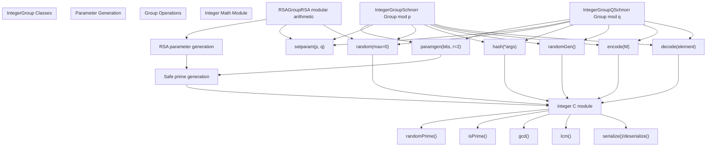
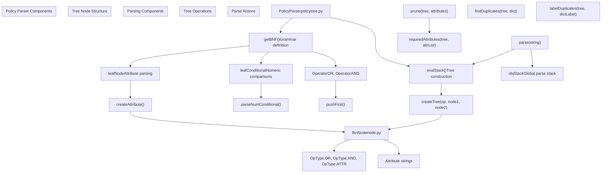
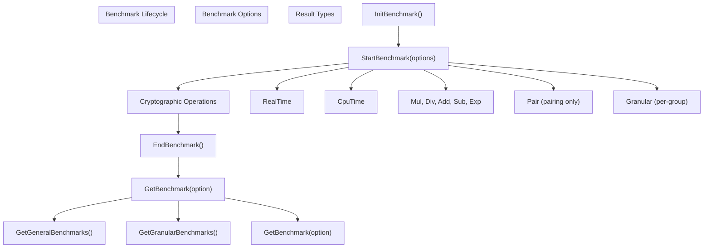

# Python Cryptographic Framework

> **Relevant source files**
> * [charm/schemes/ibenc/ibenc_cllww12_z.py](https://github.com/JHUISI/charm/blob/7b52fa53/charm/schemes/ibenc/ibenc_cllww12_z.py)
> * [charm/schemes/ibenc/ibenc_waters05_z.py](https://github.com/JHUISI/charm/blob/7b52fa53/charm/schemes/ibenc/ibenc_waters05_z.py)
> * [charm/schemes/ibenc/ibenc_waters09_z.py](https://github.com/JHUISI/charm/blob/7b52fa53/charm/schemes/ibenc/ibenc_waters09_z.py)
> * [charm/toolbox/ecgroup.py](https://github.com/JHUISI/charm/blob/7b52fa53/charm/toolbox/ecgroup.py)
> * [charm/toolbox/integergroup.py](https://github.com/JHUISI/charm/blob/7b52fa53/charm/toolbox/integergroup.py)
> * [charm/toolbox/pairinggroup.py](https://github.com/JHUISI/charm/blob/7b52fa53/charm/toolbox/pairinggroup.py)
> * [charm/toolbox/policytree.py](https://github.com/JHUISI/charm/blob/7b52fa53/charm/toolbox/policytree.py)
> * [charm/toolbox/zknode.py](https://github.com/JHUISI/charm/blob/7b52fa53/charm/toolbox/zknode.py)

This document covers the high-level Python abstractions that form Charm-Crypto's developer-facing API. These abstractions provide unified interfaces for pairing-based cryptography, elliptic curve operations, and integer arithmetic while hiding the complexity of the underlying C implementations and cryptographic library backends.

For information about the underlying mathematical implementations, see [Core Mathematical Foundation](/JHUISI/charm/3-core-mathematical-foundation). For documentation of specific cryptographic schemes that use these abstractions, see [Cryptographic Schemes](/JHUISI/charm/6-cryptographic-schemes).

## Group Abstraction Architecture

The Python framework is built around a unified group abstraction that provides consistent interfaces across different mathematical structures. This design allows cryptographic schemes to be written generically and work with multiple underlying mathematical groups.

### Group Interface Hierarchy

```

```

**Sources:** [charm/toolbox/pairinggroup.py L1-L188](https://github.com/JHUISI/charm/blob/7b52fa53/charm/toolbox/pairinggroup.py#L1-L188)

 [charm/toolbox/ecgroup.py L1-L145](https://github.com/JHUISI/charm/blob/7b52fa53/charm/toolbox/ecgroup.py#L1-L145)

 [charm/toolbox/integergroup.py L1-L297](https://github.com/JHUISI/charm/blob/7b52fa53/charm/toolbox/integergroup.py#L1-L297)

### Unified API Pattern

All group implementations follow a consistent pattern that provides:

| Method | Purpose | Return Type |
| --- | --- | --- |
| `groupSetting()` | Identifies the mathematical setting | `str` |
| `groupType()` | Returns specific group parameters | varies |
| `random(type)` | Generates random group elements | group element |
| `hash(data, type)` | Hashes data to group elements | group element |
| `serialize(obj)` | Converts elements to bytes | `bytes` |
| `deserialize(bytes)` | Reconstructs elements from bytes | group element |
| `order()` | Returns group order | integer |

**Sources:** [charm/toolbox/pairinggroup.py L38-L41](https://github.com/JHUISI/charm/blob/7b52fa53/charm/toolbox/pairinggroup.py#L38-L41)

 [charm/toolbox/ecgroup.py L17-L32](https://github.com/JHUISI/charm/blob/7b52fa53/charm/toolbox/ecgroup.py#L17-L32)

 [charm/toolbox/integergroup.py L45-L59](https://github.com/JHUISI/charm/blob/7b52fa53/charm/toolbox/integergroup.py#L45-L59)

## PairingGroup Framework

The `PairingGroup` class provides the primary interface for pairing-based cryptography, supporting Type-1, Type-2, and Type-3 pairings across multiple curve families.

### PairingGroup Architecture

```

```

**Sources:** [charm/toolbox/pairinggroup.py L10-L34](https://github.com/JHUISI/charm/blob/7b52fa53/charm/toolbox/pairinggroup.py#L10-L34)

 [charm/toolbox/pairinggroup.py L77-L91](https://github.com/JHUISI/charm/blob/7b52fa53/charm/toolbox/pairinggroup.py#L77-L91)

 [charm/toolbox/pairinggroup.py L149-L177](https://github.com/JHUISI/charm/blob/7b52fa53/charm/toolbox/pairinggroup.py#L149-L177)

### PairingGroup Initialization and Configuration

The `PairingGroup` constructor supports multiple initialization modes:

```
# String-based curve selection
group = PairingGroup('SS512')      # Supersingular curve
group = PairingGroup('MNT224')     # MNT curve

# Integer-based curve ID
group = PairingGroup(1)            # Numeric curve identifier

# File-based parameters (legacy)
group = PairingGroup('params.txt', param_file=True)
```

The initialization process handles curve parameter resolution through [charm/toolbox/pairinggroup.py L15-L26](https://github.com/JHUISI/charm/blob/7b52fa53/charm/toolbox/pairinggroup.py#L15-L26)

 and selects the appropriate backend library based on configuration.

**Sources:** [charm/toolbox/pairinggroup.py L11-L32](https://github.com/JHUISI/charm/blob/7b52fa53/charm/toolbox/pairinggroup.py#L11-L32)

### Element Generation and Manipulation

The framework provides type-safe element generation with support for seeded randomness:

```
# Single element generation
r = group.random(ZR)           # Random scalar
g1 = group.random(G1)          # Random G1 element
g2 = group.random(G2)          # Random G2 element
gt = group.random(GT)          # Random GT element

# Batch generation
r1, r2, r3 = group.random(ZR, count=3)

# Seeded generation for reproducibility
g = group.random(G1, seed=12345)
```

The GT group uses cached pairing computation for efficiency [charm/toolbox/pairinggroup.py L79-L83](https://github.com/JHUISI/charm/blob/7b52fa53/charm/toolbox/pairinggroup.py#L79-L83)

**Sources:** [charm/toolbox/pairinggroup.py L77-L91](https://github.com/JHUISI/charm/blob/7b52fa53/charm/toolbox/pairinggroup.py#L77-L91)

## Elliptic Curve Group Framework

The `ECGroup` class provides elliptic curve operations over standard curves with support for point encoding and coordinate extraction.

### ECGroup Architecture

```

```

**Sources:** [charm/toolbox/ecgroup.py L8-L52](https://github.com/JHUISI/charm/blob/7b52fa53/charm/toolbox/ecgroup.py#L8-L52)

 [charm/toolbox/ecgroup.py L62-L95](https://github.com/JHUISI/charm/blob/7b52fa53/charm/toolbox/ecgroup.py#L62-L95)

 [charm/toolbox/ecgroup.py L97-L107](https://github.com/JHUISI/charm/blob/7b52fa53/charm/toolbox/ecgroup.py#L97-L107)

### Message Encoding in Elliptic Curves

The ECGroup provides probabilistic message encoding that maps arbitrary byte strings to curve points:

```
# Encode message to curve point
msg = b"secret message"
point = group.encode(msg, include_ctr=False)

# Decode point back to message  
recovered = group.decode(point, include_ctr=False)
assert msg == recovered
```

The encoding uses a counter-based approach when `include_ctr=True` for deterministic encoding [charm/toolbox/ecgroup.py L46-L52](https://github.com/JHUISI/charm/blob/7b52fa53/charm/toolbox/ecgroup.py#L46-L52)

**Sources:** [charm/toolbox/ecgroup.py L46-L52](https://github.com/JHUISI/charm/blob/7b52fa53/charm/toolbox/ecgroup.py#L46-L52)

### Hash Function Design

The ECGroup implements a sophisticated hash function that handles multiple data types using TupleHash-inspired encoding:

```
# Hash different data types
h1 = group.hash("string")
h2 = group.hash(b"bytes") 
h3 = group.hash(12345)
h4 = group.hash((point1, point2, "mixed"))  # Tuple hash
```

The hash encoding function [charm/toolbox/ecgroup.py L67-L94](https://github.com/JHUISI/charm/blob/7b52fa53/charm/toolbox/ecgroup.py#L67-L94)

 provides type-specific serialization with length prefixing for security.

**Sources:** [charm/toolbox/ecgroup.py L62-L95](https://github.com/JHUISI/charm/blob/7b52fa53/charm/toolbox/ecgroup.py#L62-L95)

## Integer Group Framework

The integer group framework provides three distinct group implementations for different cryptographic applications.

### Integer Group Classes



**Sources:** [charm/toolbox/integergroup.py L8-L85](https://github.com/JHUISI/charm/blob/7b52fa53/charm/toolbox/integergroup.py#L8-L85)

 [charm/toolbox/integergroup.py L108-L213](https://github.com/JHUISI/charm/blob/7b52fa53/charm/toolbox/integergroup.py#L108-L213)

 [charm/toolbox/integergroup.py L215-L297](https://github.com/JHUISI/charm/blob/7b52fa53/charm/toolbox/integergroup.py#L215-L297)

### Safe Prime Generation

The integer groups use safe prime generation for security [charm/toolbox/integergroup.py L27-L35](https://github.com/JHUISI/charm/blob/7b52fa53/charm/toolbox/integergroup.py#L27-L35)

:

```
# Generate safe primes where p = 2q + 1
group = IntegerGroup()
group.paramgen(1024)  # 1024-bit safe primes

# Manual parameter setting
p = 23  # Safe prime
q = 11  # Sophie Germain prime  
group.setparam(p, q)
```

The paramgen process ensures both `p` and `q` are prime with the safe prime relationship [charm/toolbox/integergroup.py L29-L35](https://github.com/JHUISI/charm/blob/7b52fa53/charm/toolbox/integergroup.py#L29-L35)

**Sources:** [charm/toolbox/integergroup.py L27-L35](https://github.com/JHUISI/charm/blob/7b52fa53/charm/toolbox/integergroup.py#L27-L35)

 [charm/toolbox/integergroup.py L118-L134](https://github.com/JHUISI/charm/blob/7b52fa53/charm/toolbox/integergroup.py#L118-L134)

## Policy and Tree Utilities

The framework includes utilities for parsing and manipulating access control policies used in attribute-based encryption schemes.

### Policy Tree Architecture



**Sources:** [charm/toolbox/policytree.py L42-L87](https://github.com/JHUISI/charm/blob/7b52fa53/charm/toolbox/policytree.py#L42-L87)

 [charm/toolbox/policytree.py L106-L154](https://github.com/JHUISI/charm/blob/7b52fa53/charm/toolbox/policytree.py#L106-L154)

### Policy Parsing Examples

The policy parser supports logical expressions with attribute-based access control:

```
parser = PolicyParser()

# Simple OR policy
tree1 = parser.parse("attr1 or attr2")

# Complex nested policy  
tree2 = parser.parse("(dept:cs and role:faculty) or (dept:ee and clearance:secret)")

# Policy evaluation
user_attrs = ['dept:cs', 'role:faculty'] 
result = parser.prune(tree2, user_attrs)  # Returns satisfied attributes
```

The parser uses pyparsing for robust grammar handling [charm/toolbox/policytree.py L47-L71](https://github.com/JHUISI/charm/blob/7b52fa53/charm/toolbox/policytree.py#L47-L71)

 and supports attribute negation with the `!` operator.

**Sources:** [charm/toolbox/policytree.py L9-L25](https://github.com/JHUISI/charm/blob/7b52fa53/charm/toolbox/policytree.py#L9-L25)

 [charm/toolbox/policytree.py L156-L169](https://github.com/JHUISI/charm/blob/7b52fa53/charm/toolbox/policytree.py#L156-L169)

### Tree Pruning and Evaluation

The policy framework provides sophisticated tree evaluation that determines minimal attribute sets:

```
def requiredAttributes(tree, attrList):
    """Determines required attributes to satisfy policy tree"""
    # Recursive evaluation of OR/AND nodes
    # Returns (satisfied: bool, minimal_attrs: list)
```

The pruning algorithm [charm/toolbox/policytree.py L120-L154](https://github.com/JHUISI/charm/blob/7b52fa53/charm/toolbox/policytree.py#L120-L154)

 implements short-circuit evaluation for OR nodes and conjunction checking for AND nodes.

**Sources:** [charm/toolbox/policytree.py L106-L154](https://github.com/JHUISI/charm/blob/7b52fa53/charm/toolbox/policytree.py#L106-L154)

## Benchmarking and Performance

All group implementations provide unified benchmarking APIs for performance analysis.

### Benchmark API Pattern



**Sources:** [charm/toolbox/pairinggroup.py L153-L177](https://github.com/JHUISI/charm/blob/7b52fa53/charm/toolbox/pairinggroup.py#L153-L177)

 [charm/toolbox/ecgroup.py L120-L144](https://github.com/JHUISI/charm/blob/7b52fa53/charm/toolbox/ecgroup.py#L120-L144)

 [charm/toolbox/integergroup.py L86-L107](https://github.com/JHUISI/charm/blob/7b52fa53/charm/toolbox/integergroup.py#L86-L107)

### Usage Example

```
# Initialize benchmarking
group.InitBenchmark()

# Start timing and operation counting
group.StartBenchmark(['RealTime', 'Mul', 'Exp'])

# Perform operations
result = group.random(G1) ** group.random(ZR)

# Get results
timing = group.GetBenchmark('RealTime')
mul_count = group.GetBenchmark('Mul') 
exp_count = group.GetBenchmark('Exp')
```

The benchmarking system integrates with the underlying C modules to provide accurate operation counts and timing measurements.

**Sources:** [charm/toolbox/pairinggroup.py L153-L177](https://github.com/JHUISI/charm/blob/7b52fa53/charm/toolbox/pairinggroup.py#L153-L177)

## Common Design Patterns

### Error Handling and Validation

The framework implements consistent validation patterns:

```
# Parameter validation
assert isinstance(secparam, int) and secparam >= 1, "Security parameter must be positive"

# Type checking for serialization
assert type(object) == integer, "Cannot serialize non-integer types"

# Membership testing
if not ismember(self.Pairing, obj): 
    return False
```

**Sources:** [charm/toolbox/pairinggroup.py

29](https://github.com/JHUISI/charm/blob/7b52fa53/charm/toolbox/pairinggroup.py#L29-L29)

 [charm/toolbox/integergroup.py

73](https://github.com/JHUISI/charm/blob/7b52fa53/charm/toolbox/integergroup.py#L73-L73)

 [charm/toolbox/pairinggroup.py

47](https://github.com/JHUISI/charm/blob/7b52fa53/charm/toolbox/pairinggroup.py#L47-L47)

### Debug Output Support

All group classes provide debug output capabilities:

```
def debug(self, data, prefix=None):
    """Unified debug output for different data types"""
    if type(data) == dict:
        for k,v in data.items():
            print(k,v)
    elif type(data) == list:
        for i in range(0, len(data)):
            print(prefix, (i+1),':',data[i])
```

This allows consistent debugging across different cryptographic schemes [charm/toolbox/pairinggroup.py L133-L147](https://github.com/JHUISI/charm/blob/7b52fa53/charm/toolbox/pairinggroup.py#L133-L147)

**Sources:** [charm/toolbox/pairinggroup.py L133-L147](https://github.com/JHUISI/charm/blob/7b52fa53/charm/toolbox/pairinggroup.py#L133-L147)

 [charm/toolbox/ecgroup.py L108-L118](https://github.com/JHUISI/charm/blob/7b52fa53/charm/toolbox/ecgroup.py#L108-L118)