# RELIC Integration

> **Relevant source files**
> * [charm/core/math/pairing/miracl/bn_pair.patch](https://github.com/JHUISI/charm/blob/7b52fa53/charm/core/math/pairing/miracl/bn_pair.patch)
> * [charm/core/math/pairing/relic/buildRELIC.sh](https://github.com/JHUISI/charm/blob/7b52fa53/charm/core/math/pairing/relic/buildRELIC.sh)
> * [charm/core/math/pairing/relic/pairingmodule3.c](https://github.com/JHUISI/charm/blob/7b52fa53/charm/core/math/pairing/relic/pairingmodule3.c)
> * [charm/core/math/pairing/relic/relic_interface.c](https://github.com/JHUISI/charm/blob/7b52fa53/charm/core/math/pairing/relic/relic_interface.c)
> * [charm/core/math/pairing/relic/relic_interface.h](https://github.com/JHUISI/charm/blob/7b52fa53/charm/core/math/pairing/relic/relic_interface.h)
> * [charm/core/math/pairing/relic/test_relic.c](https://github.com/JHUISI/charm/blob/7b52fa53/charm/core/math/pairing/relic/test_relic.c)

## Purpose and Scope

The RELIC integration provides Charm-Crypto with a high-performance pairing-based cryptography backend. RELIC (REasonabLy effIcient Cryptographic Library) is an efficient cryptographic library that implements elliptic curve cryptography and pairing-based cryptography primitives. This integration enables Charm to perform operations on pairing groups G1, G2, GT, and the ring ZR with optimal performance.

This document covers the RELIC-specific implementation within Charm's pairing module. For information about other cryptographic backends, see [MIRACL Integration](/JHUISI/charm/4.2-miracl-integration). For the broader mathematical foundation that this supports, see [Core Mathematical Foundation](/JHUISI/charm/3-core-mathematical-foundation).

## Architecture Overview

The RELIC integration follows a multi-layered architecture that bridges Python-level cryptographic objects with the native RELIC library through carefully designed C extension interfaces.

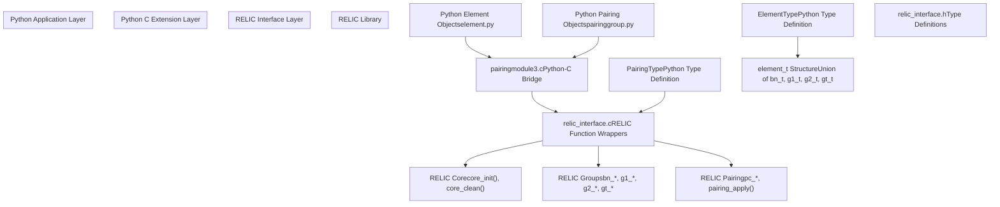

**Sources:** [charm/core/math/pairing/relic/pairingmodule3.c L1-L50](https://github.com/JHUISI/charm/blob/7b52fa53/charm/core/math/pairing/relic/pairingmodule3.c#L1-L50)

 [charm/core/math/pairing/relic/relic_interface.h L77-L96](https://github.com/JHUISI/charm/blob/7b52fa53/charm/core/math/pairing/relic/relic_interface.h#L77-L96)

## Element Types and Groups

RELIC integration supports four mathematical groups essential for pairing-based cryptography, each mapped to specific RELIC types and operations.

```mermaid
flowchart TD

subgraph Element_Operations ["Element Operations"]
end

subgraph RELIC_Native_Types ["RELIC Native Types"]
end

subgraph Mathematical_Groups ["Mathematical Groups"]
end

ZR["ZR: Ring of IntegersScalars mod p"]
G1["G1: Elliptic Curve GroupAdditive Group"]
G2["G2: Elliptic Curve GroupAdditive Group"]
GT["GT: Target GroupMultiplicative Group"]
bn_t["bn_tBig Number"]
g1_t["g1_tG1 Point"]
g2_t["g2_tG2 Point"]
gt_t["gt_tGT Element"]
AddOps["Addition/Subtractionelement_add(), element_sub()"]
MulOps["Multiplicationelement_mul(), element_mul_zr()"]
PowOps["Exponentiationelement_pow_zr(), element_pow_int()"]
PairOps["Pairingpairing_apply()"]
```

**Sources:** [charm/core/math/pairing/relic/relic_interface.h L56-L57](https://github.com/JHUISI/charm/blob/7b52fa53/charm/core/math/pairing/relic/relic_interface.h#L56-L57)

 [charm/core/math/pairing/relic/relic_interface.h L77-L85](https://github.com/JHUISI/charm/blob/7b52fa53/charm/core/math/pairing/relic/relic_interface.h#L77-L85)

### Element Structure Definition

The core `element_t` structure is a union that can represent any of the four group types:

| Field | Type | Purpose |
| --- | --- | --- |
| `isInitialized` | `int` | Tracks initialization state |
| `type` | `GroupType` | Identifies which group (ZR, G1, G2, GT) |
| `order` | `bn_t` | Group order for modular operations |
| `bn` | `bn_t` | Big number for ZR elements |
| `g1` | `g1_t` | G1 group element |
| `g2` | `g2_t` | G2 group element |
| `gt` | `gt_t` | GT group element |

**Sources:** [charm/core/math/pairing/relic/relic_interface.h L77-L85](https://github.com/JHUISI/charm/blob/7b52fa53/charm/core/math/pairing/relic/relic_interface.h#L77-L85)

## Python C Extension Interface

The `pairingmodule3.c` file implements the Python C extension that exposes RELIC functionality to Python. It defines Python types and methods that correspond to mathematical operations.

### Key Python Type Definitions

```mermaid
flowchart TD

subgraph Utility_Methods ["Utility Methods"]
end

subgraph Arithmetic_Methods ["Arithmetic Methods"]
end

subgraph Element_Methods ["Element Methods"]
end

subgraph Python_Types ["Python Types"]
end

ElementType["ElementTypePython Element Class"]
PairingType["PairingTypePython Pairing Class"]
ElemNew["Element_new()Object allocation"]
ElemInit["Element_init()Initialization"]
ElemDealloc["Element_dealloc()Cleanup"]
ElemRandom["Element_random()Random generation"]
ElemSet["Element_set()Value assignment"]
ElemAdd["Element_add()Addition operator"]
ElemSub["Element_sub()Subtraction operator"]
ElemMul["Element_mul()Multiplication operator"]
ElemDiv["Element_div()Division operator"]
ElemPow["Element_pow()Exponentiation operator"]
ElemEquals["Element_equals()Comparison operator"]
ElemHash["Element_hash()Hash function"]
ElemPrint["Element_print()String representation"]
ApplyPairing["Apply_pairing()Pairing computation"]

    ElementType --> ElemNew
    ElementType --> ElemInit
    ElementType --> ElemDealloc
    ElementType --> ElemRandom
    ElementType --> ElemSet
    ElementType --> ElemAdd
    ElementType --> ElemSub
    ElementType --> ElemMul
    ElementType --> ElemDiv
    ElementType --> ElemPow
    ElementType --> ElemEquals
    ElementType --> ElemHash
    ElementType --> ElemPrint
    PairingType --> ApplyPairing
```

**Sources:** [charm/core/math/pairing/relic/pairingmodule3.c L402-L435](https://github.com/JHUISI/charm/blob/7b52fa53/charm/core/math/pairing/relic/pairingmodule3.c#L402-L435)

 [charm/core/math/pairing/relic/pairingmodule3.c L566-L617](https://github.com/JHUISI/charm/blob/7b52fa53/charm/core/math/pairing/relic/pairingmodule3.c#L566-L617)

### Element Creation and Management

The `createNewElement()` function is central to element management, handling the initialization of elements in specific groups:

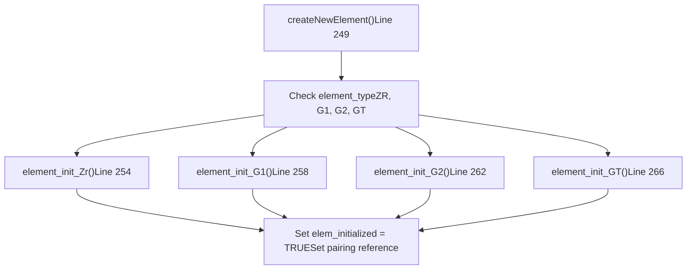

**Sources:** [charm/core/math/pairing/relic/pairingmodule3.c L249-L275](https://github.com/JHUISI/charm/blob/7b52fa53/charm/core/math/pairing/relic/pairingmodule3.c#L249-L275)

## RELIC Interface Layer

The `relic_interface.c` file provides a clean abstraction layer over RELIC's native functions, handling initialization, arithmetic operations, and memory management.

### Initialization and Cleanup

| Function | Purpose | RELIC Calls |
| --- | --- | --- |
| `pairing_init()` | Initialize RELIC core | `core_init()`, `pc_param_set_any()` |
| `pairing_clear()` | Cleanup RELIC core | `core_clean()` |
| `element_init_Zr()` | Initialize ZR element | `bn_inits()`, `g1_get_ord()` |
| `element_init_G1()` | Initialize G1 element | `g1_inits()`, `g1_set_infty()` |
| `element_init_G2()` | Initialize G2 element | `g2_inits()`, `g2_set_infty()` |
| `element_init_GT()` | Initialize GT element | `gt_inits()`, `gt_set_unity()` |

**Sources:** [charm/core/math/pairing/relic/relic_interface.c L101-L168](https://github.com/JHUISI/charm/blob/7b52fa53/charm/core/math/pairing/relic/relic_interface.c#L101-L168)

### Core Arithmetic Operations

The interface layer implements type-safe arithmetic operations with proper error checking:

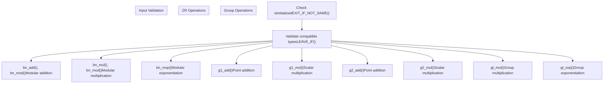

**Sources:** [charm/core/math/pairing/relic/relic_interface.c L373-L459](https://github.com/JHUISI/charm/blob/7b52fa53/charm/core/math/pairing/relic/relic_interface.c#L373-L459)

 [charm/core/math/pairing/relic/relic_interface.c L692-L750](https://github.com/JHUISI/charm/blob/7b52fa53/charm/core/math/pairing/relic/relic_interface.c#L692-L750)

## Memory Management

The RELIC integration implements careful memory management to prevent leaks and ensure proper cleanup of both Python objects and RELIC native structures.

### Element Lifecycle

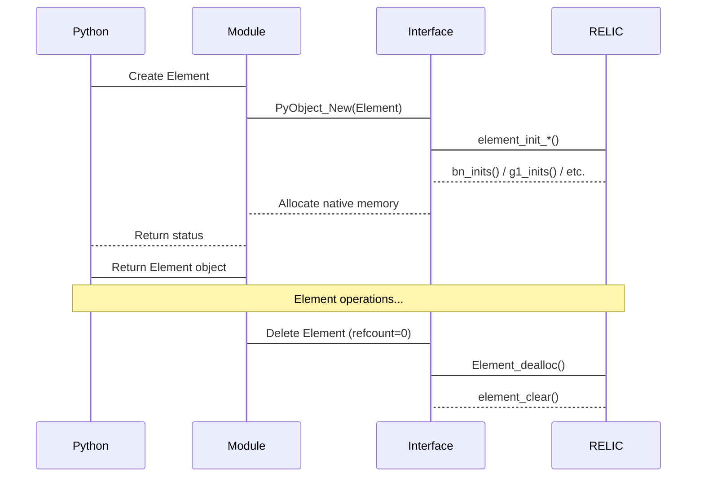

**Sources:** [charm/core/math/pairing/relic/pairingmodule3.c L309-L321](https://github.com/JHUISI/charm/blob/7b52fa53/charm/core/math/pairing/relic/pairingmodule3.c#L309-L321)

 [charm/core/math/pairing/relic/relic_interface.c L343-L371](https://github.com/JHUISI/charm/blob/7b52fa53/charm/core/math/pairing/relic/relic_interface.c#L343-L371)

### Reference Counting and Cleanup

The implementation maintains proper Python reference counting while ensuring RELIC resources are freed:

| Component | Cleanup Function | Responsibilities |
| --- | --- | --- |
| Element Object | `Element_dealloc()` | Clear RELIC element, decrement pairing reference |
| Pairing Object | `Pairing_dealloc()` | Call `pairing_clear()`, free benchmark objects |
| RELIC Element | `element_clear()` | Free native memory (`bn_free()`, `g1_free()`, etc.) |
| Preprocessing | `element_pp_clear()` | Free precomputation tables |

**Sources:** [charm/core/math/pairing/relic/pairingmodule3.c L289-L321](https://github.com/JHUISI/charm/blob/7b52fa53/charm/core/math/pairing/relic/pairingmodule3.c#L289-L321)

## Arithmetic Operations

The RELIC integration implements comprehensive arithmetic operations following mathematical rules for each group type.

### Operation Validation Rules

The implementation enforces mathematical constraints through validation functions:

| Function | Purpose | Valid Combinations |
| --- | --- | --- |
| `add_rule()` | Addition validation | Same type, not GT |
| `sub_rule()` | Subtraction validation | Same type, not GT |
| `mul_rule()` | Multiplication validation | Same type or one ZR |
| `div_rule()` | Division validation | Same type |
| `exp_rule()` | Exponentiation validation | Base in group, exponent ZR |
| `pair_rule()` | Pairing validation | G1 × G2 → GT |

**Sources:** [charm/core/math/pairing/relic/pairingmodule3.c L32-L71](https://github.com/JHUISI/charm/blob/7b52fa53/charm/core/math/pairing/relic/pairingmodule3.c#L32-L71)

### Preprocessing Support

RELIC integration supports preprocessing for repeated exponentiations, providing significant performance improvements:

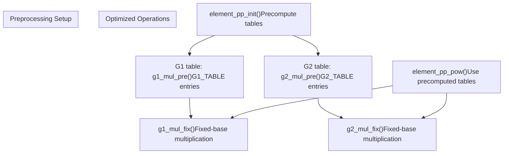

**Sources:** [charm/core/math/pairing/relic/relic_interface.c L170-L248](https://github.com/JHUISI/charm/blob/7b52fa53/charm/core/math/pairing/relic/relic_interface.c#L170-L248)

 [charm/core/math/pairing/relic/pairingmodule3.c L930-L944](https://github.com/JHUISI/charm/blob/7b52fa53/charm/core/math/pairing/relic/pairingmodule3.c#L930-L944)

## Pairing Operations

The pairing functionality maps G1 × G2 elements to GT elements using RELIC's optimized pairing implementation.

### Pairing Computation Flow

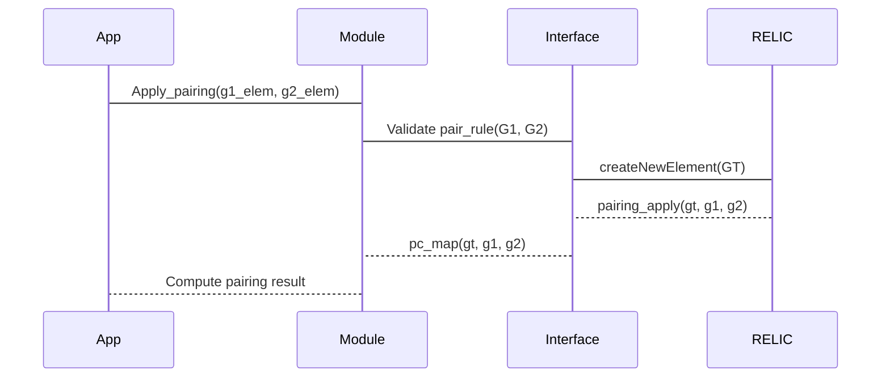

**Sources:** [charm/core/math/pairing/relic/pairingmodule3.c L1019-L1061](https://github.com/JHUISI/charm/blob/7b52fa53/charm/core/math/pairing/relic/pairingmodule3.c#L1019-L1061)

### Pairing Rules and Validation

The implementation enforces the mathematical requirement that pairings operate on G1 × G2:

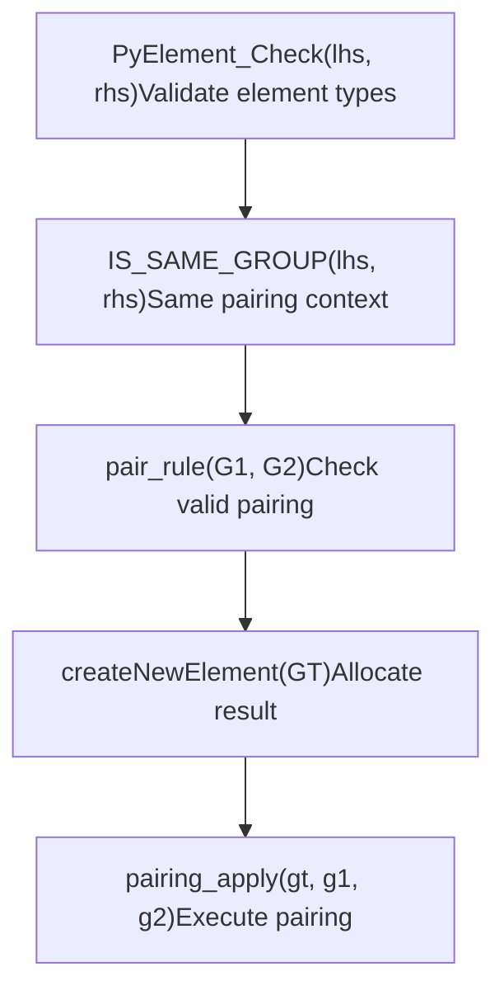

**Sources:** [charm/core/math/pairing/relic/pairingmodule3.c L66-L71](https://github.com/JHUISI/charm/blob/7b52fa53/charm/core/math/pairing/relic/pairingmodule3.c#L66-L71)

 [charm/core/math/pairing/relic/pairingmodule3.c L1041-L1052](https://github.com/JHUISI/charm/blob/7b52fa53/charm/core/math/pairing/relic/pairingmodule3.c#L1041-L1052)

## Serialization and Conversion

The RELIC integration provides comprehensive serialization support for persistent storage and network transmission of cryptographic elements.

### Serialization Functions

| Group | To Bytes | From Bytes | String Format |
| --- | --- | --- | --- |
| ZR | `bn_write_bin()` | `bn_read_bin()` | `bn_write_str()` |
| G1 | `charm_g1_write_bin()` | `charm_g1_read_bin()` | `charm_g1_write_str()` |
| G2 | `charm_g2_write_bin()` | `charm_g2_read_bin()` | `charm_g2_write_str()` |
| GT | `charm_gt_write_bin()` | `charm_gt_read_bin()` | `charm_gt_write_str()` |

**Sources:** [charm/core/math/pairing/relic/relic_interface.c L1129-L1199](https://github.com/JHUISI/charm/blob/7b52fa53/charm/core/math/pairing/relic/relic_interface.c#L1129-L1199)

 [charm/core/math/pairing/relic/relic_interface.c L882-L1127](https://github.com/JHUISI/charm/blob/7b52fa53/charm/core/math/pairing/relic/relic_interface.c#L882-L1127)

### Hash-to-Element Functions

The integration supports hashing arbitrary data to group elements using SHA-256:

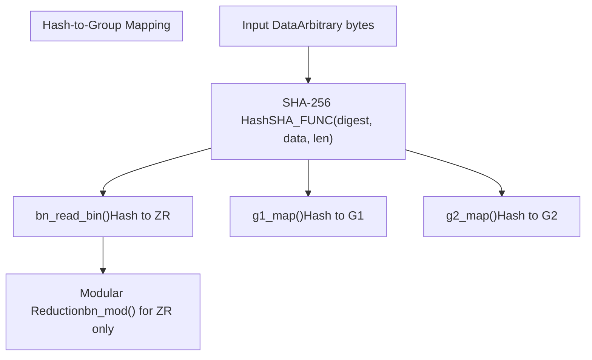

**Sources:** [charm/core/math/pairing/relic/relic_interface.c L835-L865](https://github.com/JHUISI/charm/blob/7b52fa53/charm/core/math/pairing/relic/relic_interface.c#L835-L865)

 [charm/core/math/pairing/relic/pairingmodule3.c L1094-L1241](https://github.com/JHUISI/charm/blob/7b52fa53/charm/core/math/pairing/relic/pairingmodule3.c#L1094-L1241)

## Build Configuration

The RELIC library is configured and built using specific optimizations for pairing-based cryptography through the `buildRELIC.sh` script.

### CMake Configuration Parameters

| Parameter | Value | Purpose |
| --- | --- | --- |
| `DVERBS=off` | Disabled | Reduce build verbosity |
| `DDEBUG=off` | Disabled | Optimized release build |
| `DSHLIB=on` | Enabled | Build shared library |
| `DWITH="ALL"` | All modules | Include all RELIC functionality |
| `DARITH=gmp` | GMP backend | Use GMP for big integer arithmetic |
| `DFP_PRIME=256` | 256-bit | 256-bit finite field arithmetic |
| `DALLOC=DYNAMIC` | Dynamic | Dynamic memory allocation |

**Sources:** [charm/core/math/pairing/relic/buildRELIC.sh L14-L15](https://github.com/JHUISI/charm/blob/7b52fa53/charm/core/math/pairing/relic/buildRELIC.sh#L14-L15)

### Performance Optimizations

The build configuration includes specific method selections for optimal performance:

```mermaid
flowchart TD

subgraph Compilation_Options ["Compilation Options"]
end

subgraph Pairing_Methods ["Pairing Methods"]
end

subgraph Elliptic_Curve_Methods ["Elliptic Curve Methods"]
end

subgraph Field_Arithmetic_Methods ["Field Arithmetic Methods"]
end

COMP_FLAGS["COMP-O2 -funroll-loops -fomit-frame-pointer"]
BN_PRECI["BN_PRECI=256256-bit precision"]
PC_METHD["PC_METHDPRIME pairing computation"]
PP_METHD["PP_METHDINTEG;INTEG;LAZYR;OATEP"]
EC_METHD["EC_METHDPRIME curve implementation"]
EP_METHD["EP_METHDBASIC;LWNAF;COMBS;INTER"]
EP_KBLTZ["EP_KBLTZ=onEnable Koblitz curves"]
FP_METHD["FP_METHDBASIC;COMBA;COMBA;MONTY;LOWER;MONTY"]
FP_QNRES["FP_QNRES=offDisable quadratic non-residue"]
```

**Sources:** [charm/core/math/pairing/relic/buildRELIC.sh L14-L15](https://github.com/JHUISI/charm/blob/7b52fa53/charm/core/math/pairing/relic/buildRELIC.sh#L14-L15)