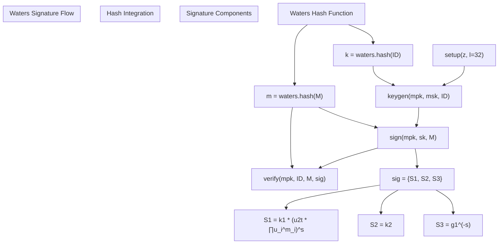
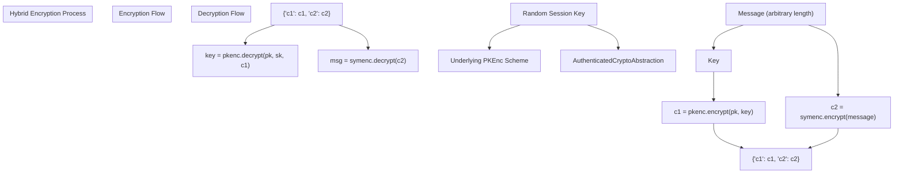
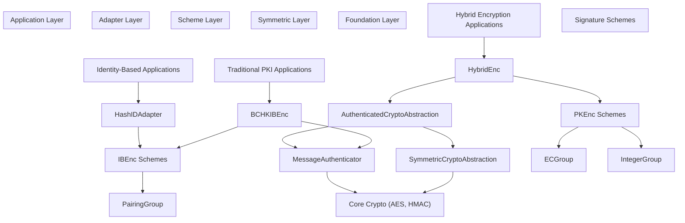

# Symmetric Cryptography and PKI Schemes

> **Relevant source files**
> * [.github/workflows/ci.yml](https://github.com/JHUISI/charm/blob/7b52fa53/.github/workflows/ci.yml)
> * [README.md](https://github.com/JHUISI/charm/blob/7b52fa53/README.md)
> * [charm/adapters/pkenc_adapt_bchk05.py](https://github.com/JHUISI/charm/blob/7b52fa53/charm/adapters/pkenc_adapt_bchk05.py)
> * [charm/adapters/pkenc_adapt_hybrid.py](https://github.com/JHUISI/charm/blob/7b52fa53/charm/adapters/pkenc_adapt_hybrid.py)
> * [charm/schemes/encap_bchk05.py](https://github.com/JHUISI/charm/blob/7b52fa53/charm/schemes/encap_bchk05.py)
> * [charm/schemes/ibenc/ibenc_bb03.py](https://github.com/JHUISI/charm/blob/7b52fa53/charm/schemes/ibenc/ibenc_bb03.py)
> * [charm/schemes/ibenc/ibenc_bf01.py](https://github.com/JHUISI/charm/blob/7b52fa53/charm/schemes/ibenc/ibenc_bf01.py)
> * [charm/schemes/ibenc/ibenc_waters05.py](https://github.com/JHUISI/charm/blob/7b52fa53/charm/schemes/ibenc/ibenc_waters05.py)
> * [charm/schemes/pkenc/pkenc_paillier99.py](https://github.com/JHUISI/charm/blob/7b52fa53/charm/schemes/pkenc/pkenc_paillier99.py)
> * [charm/schemes/pksig/pksig_cl03.py](https://github.com/JHUISI/charm/blob/7b52fa53/charm/schemes/pksig/pksig_cl03.py)
> * [charm/schemes/pksig/pksig_waters.py](https://github.com/JHUISI/charm/blob/7b52fa53/charm/schemes/pksig/pksig_waters.py)
> * [charm/schemes/pksig/pksig_waters05.py](https://github.com/JHUISI/charm/blob/7b52fa53/charm/schemes/pksig/pksig_waters05.py)
> * [charm/test/schemes/pkenc_test.py](https://github.com/JHUISI/charm/blob/7b52fa53/charm/test/schemes/pkenc_test.py)
> * [charm/test/toolbox/symcrypto_test.py](https://github.com/JHUISI/charm/blob/7b52fa53/charm/test/toolbox/symcrypto_test.py)
> * [charm/toolbox/paddingschemes.py](https://github.com/JHUISI/charm/blob/7b52fa53/charm/toolbox/paddingschemes.py)
> * [charm/toolbox/symcrypto.py](https://github.com/JHUISI/charm/blob/7b52fa53/charm/toolbox/symcrypto.py)

## Purpose and Scope

This section covers Charm's symmetric cryptography abstractions and public key infrastructure (PKI) schemes implementations. It includes symmetric encryption utilities, public key encryption schemes, identity-based encryption (IBE), digital signatures, and hybrid encryption adapters that bridge asymmetric and symmetric cryptography.

For attribute-based encryption schemes, see [Attribute-Based Encryption](/JHUISI/charm/6.1-attribute-based-encryption). For advanced signature schemes and cryptographic primitives beyond basic PKI, see [Digital Signatures and Advanced Schemes](/JHUISI/charm/6.3-digital-signatures-and-advanced-schemes).

## Symmetric Cryptography Abstractions

Charm provides high-level abstractions for symmetric encryption that integrate seamlessly with the asymmetric schemes. The primary classes are implemented in `charm/toolbox/symcrypto.py`.

### Core Symmetric Classes

```

```

**Sources:** [charm/toolbox/symcrypto.py L1-L280](https://github.com/JHUISI/charm/blob/7b52fa53/charm/toolbox/symcrypto.py#L1-L280)

### SymmetricCryptoAbstraction

The `SymmetricCryptoAbstraction` class provides AES-CBC encryption with PKCS7 padding. It's designed to work with keys derived from group elements rather than directly chosen symmetric keys.

| Feature | Implementation |
| --- | --- |
| **Encryption Algorithm** | AES-128 in CBC mode |
| **Padding** | PKCS7 |
| **Key Derivation** | First 16 bytes of input key |
| **IV Generation** | Random per-operation |
| **Output Format** | JSON with base64 encoding |

Key methods:

* `encrypt(message)` - [charm/toolbox/symcrypto.py L139-L146](https://github.com/JHUISI/charm/blob/7b52fa53/charm/toolbox/symcrypto.py#L139-L146)
* `decrypt(cipherText)` - [charm/toolbox/symcrypto.py L159-L161](https://github.com/JHUISI/charm/blob/7b52fa53/charm/toolbox/symcrypto.py#L159-L161)
* `_encrypt(message)` - [charm/toolbox/symcrypto.py L148-L157](https://github.com/JHUISI/charm/blob/7b52fa53/charm/toolbox/symcrypto.py#L148-L157)
* `_decrypt(cipherText)` - [charm/toolbox/symcrypto.py L163-L166](https://github.com/JHUISI/charm/blob/7b52fa53/charm/toolbox/symcrypto.py#L163-L166)

**Sources:** [charm/toolbox/symcrypto.py L90-L167](https://github.com/JHUISI/charm/blob/7b52fa53/charm/toolbox/symcrypto.py#L90-L167)

### AuthenticatedCryptoAbstraction

The `AuthenticatedCryptoAbstraction` extends `SymmetricCryptoAbstraction` to provide Authenticated Encryption with Associated Data (AEAD). It implements encrypt-then-MAC using HMAC-SHA256.

```

```

Key methods:

* `encrypt(msg, associatedData='')` - [charm/toolbox/symcrypto.py L203-L240](https://github.com/JHUISI/charm/blob/7b52fa53/charm/toolbox/symcrypto.py#L203-L240)
* `decrypt(cipherText, associatedData='')` - [charm/toolbox/symcrypto.py L242-L279](https://github.com/JHUISI/charm/blob/7b52fa53/charm/toolbox/symcrypto.py#L242-L279)

**Sources:** [charm/toolbox/symcrypto.py L168-L280](https://github.com/JHUISI/charm/blob/7b52fa53/charm/toolbox/symcrypto.py#L168-L280)

### MessageAuthenticator

The `MessageAuthenticator` class provides HMAC-based message authentication using SHA-256.

Authentication format: `MAC = HMAC(key, algorithm + associatedData + message)`

Key methods:

* `mac(msg, associatedData=b'')` - [charm/toolbox/symcrypto.py L35-L59](https://github.com/JHUISI/charm/blob/7b52fa53/charm/toolbox/symcrypto.py#L35-L59)
* `verify(msgAndDigest, associatedData=b'')` - [charm/toolbox/symcrypto.py L61-L88](https://github.com/JHUISI/charm/blob/7b52fa53/charm/toolbox/symcrypto.py#L61-L88)

**Sources:** [charm/toolbox/symcrypto.py L9-L89](https://github.com/JHUISI/charm/blob/7b52fa53/charm/toolbox/symcrypto.py#L9-L89)

## Public Key Encryption Schemes

Charm implements several foundational public key encryption schemes that serve as building blocks for more advanced constructions.

### PKEnc Hierarchy

```

```

**Sources:** [charm/schemes/pkenc/](https://github.com/JHUISI/charm/blob/7b52fa53/charm/schemes/pkenc/)

 [charm/schemes/ibenc/](https://github.com/JHUISI/charm/blob/7b52fa53/charm/schemes/ibenc/)

 [charm/test/schemes/pkenc_test.py L1-L252](https://github.com/JHUISI/charm/blob/7b52fa53/charm/test/schemes/pkenc_test.py#L1-L252)

### Paillier Cryptosystem (Pai99)

The Paillier scheme in [charm/schemes/pkenc/pkenc_paillier99.py](https://github.com/JHUISI/charm/blob/7b52fa53/charm/schemes/pkenc/pkenc_paillier99.py)

 provides additively homomorphic encryption over integers.

Key features:

* **Homomorphic Properties**: `E(m1) * E(m2) = E(m1 + m2)`
* **Custom Ciphertext Class**: Implements `__add__` and `__mul__` operators
* **Security**: Based on composite residuosity assumption

```

```

**Sources:** [charm/schemes/pkenc/pkenc_paillier99.py L1-L112](https://github.com/JHUISI/charm/blob/7b52fa53/charm/schemes/pkenc/pkenc_paillier99.py#L1-L112)

## Identity-Based Encryption Schemes

IBE schemes eliminate the need for public key certificates by using arbitrary strings as public keys.

### Boneh-Franklin IBE (BF01)

The Boneh-Franklin scheme [charm/schemes/ibenc/ibenc_bf01.py](https://github.com/JHUISI/charm/blob/7b52fa53/charm/schemes/ibenc/ibenc_bf01.py)

 is the first practical IBE based on bilinear pairings.

Core operations:

* `setup()` - [charm/schemes/ibenc/ibenc_bf01.py L40-L51](https://github.com/JHUISI/charm/blob/7b52fa53/charm/schemes/ibenc/ibenc_bf01.py#L40-L51)
* `extract(sk, ID)` - [charm/schemes/ibenc/ibenc_bf01.py L53-L59](https://github.com/JHUISI/charm/blob/7b52fa53/charm/schemes/ibenc/ibenc_bf01.py#L53-L59)
* `encrypt(pk, ID, M)` - [charm/schemes/ibenc/ibenc_bf01.py L62-L83](https://github.com/JHUISI/charm/blob/7b52fa53/charm/schemes/ibenc/ibenc_bf01.py#L62-L83)
* `decrypt(pk, sk, ct)` - [charm/schemes/ibenc/ibenc_bf01.py L85-L102](https://github.com/JHUISI/charm/blob/7b52fa53/charm/schemes/ibenc/ibenc_bf01.py#L85-L102)

### Boneh-Boyen IBE (BB03)

The Boneh-Boyen scheme [charm/schemes/ibenc/ibenc_bb03.py](https://github.com/JHUISI/charm/blob/7b52fa53/charm/schemes/ibenc/ibenc_bb03.py)

 provides selective-ID security without random oracles.

```

```

**Sources:** [charm/schemes/ibenc/ibenc_bb03.py L1-L88](https://github.com/JHUISI/charm/blob/7b52fa53/charm/schemes/ibenc/ibenc_bb03.py#L1-L88)

## Digital Signature Schemes

Charm implements both traditional and identity-based signature schemes.

### Camenisch-Lysyanskaya Signatures (CL03)

The CL03 scheme [charm/schemes/pksig/pksig_cl03.py](https://github.com/JHUISI/charm/blob/7b52fa53/charm/schemes/pksig/pksig_cl03.py)

 provides efficient protocols for zero-knowledge proofs.

Key operations:

* `keygen(secparam, p, q)` - [charm/schemes/pksig/pksig_cl03.py L61-L85](https://github.com/JHUISI/charm/blob/7b52fa53/charm/schemes/pksig/pksig_cl03.py#L61-L85)
* `sign(pk, sk, m)` - [charm/schemes/pksig/pksig_cl03.py L87-L100](https://github.com/JHUISI/charm/blob/7b52fa53/charm/schemes/pksig/pksig_cl03.py#L87-L100)
* `signCommit(pk, sk, Cx)` - [charm/schemes/pksig/pksig_cl03.py L102-L115](https://github.com/JHUISI/charm/blob/7b52fa53/charm/schemes/pksig/pksig_cl03.py#L102-L115)
* `verify(pk, m, sig)` - [charm/schemes/pksig/pksig_cl03.py L117-L129](https://github.com/JHUISI/charm/blob/7b52fa53/charm/schemes/pksig/pksig_cl03.py#L117-L129)

**Sources:** [charm/schemes/pksig/pksig_cl03.py L1-L144](https://github.com/JHUISI/charm/blob/7b52fa53/charm/schemes/pksig/pksig_cl03.py#L1-L144)

### Waters Signature Scheme

The Waters signature [charm/schemes/pksig/pksig_waters.py](https://github.com/JHUISI/charm/blob/7b52fa53/charm/schemes/pksig/pksig_waters.py)

 provides identity-based signatures without random oracles.



**Sources:** [charm/schemes/pksig/pksig_waters.py L1-L109](https://github.com/JHUISI/charm/blob/7b52fa53/charm/schemes/pksig/pksig_waters.py#L1-L109)

## Hybrid Encryption Systems

Hybrid encryption combines the efficiency of symmetric encryption with the key management benefits of asymmetric encryption.

### HybridEnc Adapter

The `HybridEnc` class [charm/adapters/pkenc_adapt_hybrid.py](https://github.com/JHUISI/charm/blob/7b52fa53/charm/adapters/pkenc_adapt_hybrid.py)

 wraps any PKEnc scheme to create a hybrid cryptosystem.



Constructor: `HybridEnc(pkenc, msg_len=16, key_len=16, mode=AES)` - [charm/adapters/pkenc_adapt_hybrid.py L26-L34](https://github.com/JHUISI/charm/blob/7b52fa53/charm/adapters/pkenc_adapt_hybrid.py#L26-L34)

Key methods:

* `encrypt(pk, M)` - [charm/adapters/pkenc_adapt_hybrid.py L43-L52](https://github.com/JHUISI/charm/blob/7b52fa53/charm/adapters/pkenc_adapt_hybrid.py#L43-L52)
* `decrypt(pk, sk, ct)` - [charm/adapters/pkenc_adapt_hybrid.py L54-L60](https://github.com/JHUISI/charm/blob/7b52fa53/charm/adapters/pkenc_adapt_hybrid.py#L54-L60)

**Sources:** [charm/adapters/pkenc_adapt_hybrid.py L1-L79](https://github.com/JHUISI/charm/blob/7b52fa53/charm/adapters/pkenc_adapt_hybrid.py#L1-L79)

### BCHK05 Transform

The BCHK05 adapter [charm/adapters/pkenc_adapt_bchk05.py](https://github.com/JHUISI/charm/blob/7b52fa53/charm/adapters/pkenc_adapt_bchk05.py)

 transforms any IBE scheme into a CCA-secure PKE scheme.

Key components:

* **IBE-to-PKE Transform**: Uses commitment schemes for CCA security
* **HMAC Authentication**: Provides integrity protection
* **Encapsulation**: Uses `EncapBCHK` for key commitment

**Sources:** [charm/adapters/pkenc_adapt_bchk05.py L1-L110](https://github.com/JHUISI/charm/blob/7b52fa53/charm/adapters/pkenc_adapt_bchk05.py#L1-L110)

 [charm/schemes/encap_bchk05.py L1-L42](https://github.com/JHUISI/charm/blob/7b52fa53/charm/schemes/encap_bchk05.py#L1-L42)

## Integration Architecture



**Sources:** [charm/adapters/](https://github.com/JHUISI/charm/blob/7b52fa53/charm/adapters/)

 [charm/schemes/](https://github.com/JHUISI/charm/blob/7b52fa53/charm/schemes/)

 [charm/toolbox/symcrypto.py](https://github.com/JHUISI/charm/blob/7b52fa53/charm/toolbox/symcrypto.py)

 [charm/test/schemes/pkenc_test.py](https://github.com/JHUISI/charm/blob/7b52fa53/charm/test/schemes/pkenc_test.py)